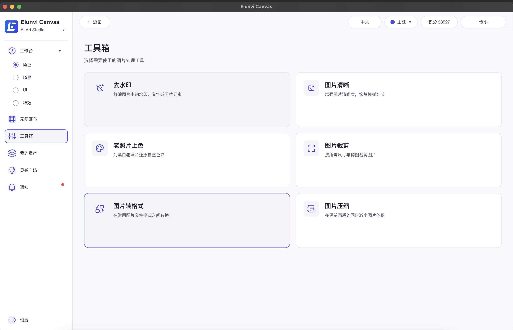
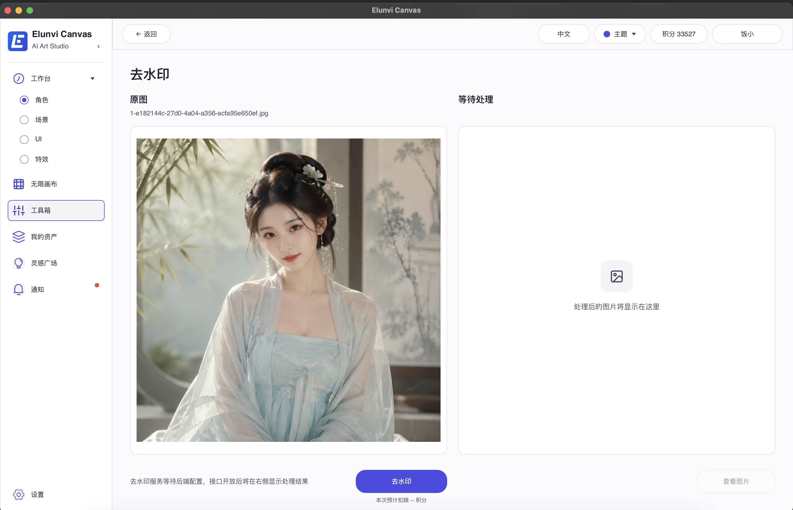
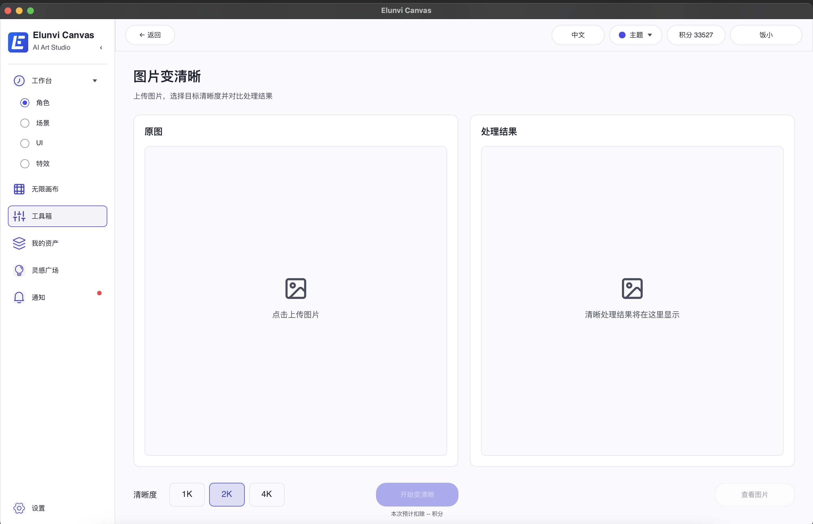
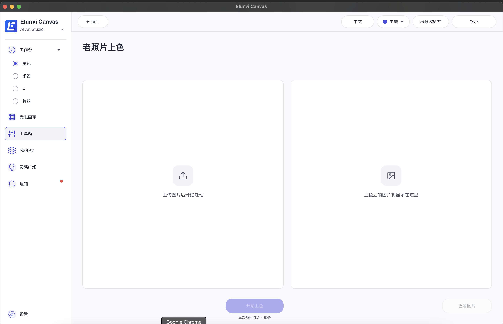
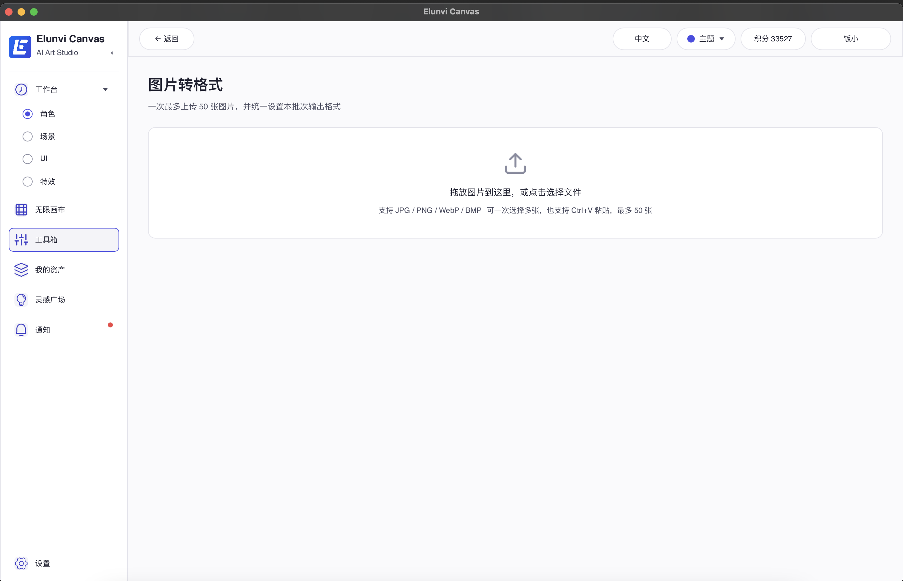
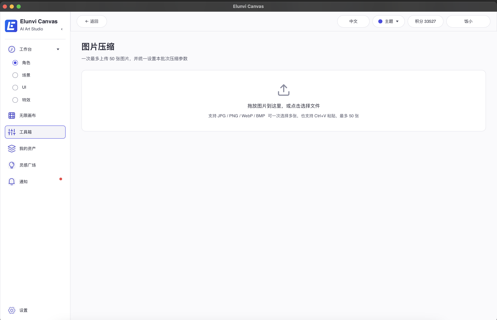

# 工具箱现状审查

日期：2026-07-30

## 结论

工具箱的六个入口、页面布局、图片选择/预览、批量文件管理和参数控件已经完成，但六项工具在工具箱流程中都没有真正执行图片处理。用户上传图片并点击主操作后，客户端只会显示“等待后端配置”。其中“图片清晰”所需的 `image_upscale` 服务端任务和客户端生成链路其实已在作品查看器中存在，工具箱页面尚未复用这条链路；其余五项未发现可用的服务端处理接口。

工具箱专项测试通过 6/6，但这些测试主要检查页面、状态和 callback 接线，不是图片处理端到端测试。

## 步骤与健康状态

### 1. 工具箱总览 — 表面完整，能力状态不透明



- 六个入口全部可点击，没有“即将开放”或“未配置”标识。
- 主要风险：页面把未上线能力表现成可正常使用，用户只能在上传并点击处理后才知道不可用。
- 卡片选中态会在返回总览后保留，容易与当前 hover 状态叠加，造成两个卡片同时像被强调。

### 2. 去水印 — 输入和结果框架完成，处理不可用



- 已完成：单图选择、原图预览、结果预览位、进度状态、查看结果入口、积分展示位。
- 当前实际行为：点击后显示“去水印服务等待后端配置”，积分为 `--`，不生成结果。
- 截图中已有历史选择的原图，说明页面状态会跨页面保留。

### 3. 图片清晰 — UI 完成，工具箱链路未接入已有放大能力



- 已完成：单图上传、原图/结果双栏、1K/2K/4K 选择、结果查看入口。
- 当前实际行为：上传后点击只显示“图片变清晰能力等待后端配置”。
- 代码库内已经存在可运行的 `image_upscale` 任务、积分预占、上传、轮询与交付链路，但目前只供作品查看器使用。

### 4. 老照片上色 — 页面完成，处理不可用



- 已完成：单图上传、双栏预览、进度与结果状态、积分展示位。
- 当前实际行为：点击后只显示“老照片上色能力等待后端配置”。
- 未发现对应服务端路由或任务类型。

### 5. 图片裁剪 — 批量工作区完成，处理不可用


- 已完成：拖放、文件选择、Ctrl+V、最多 50 张、列表管理、比例和像素尺寸设置。
- 当前实际行为：提交后只显示“图片裁剪能力等待后端配置”。
- 裁剪属于适合本地执行的确定性操作，但当前没有调用本地图片处理实现。

### 6. 图片转格式 — 批量工作区完成，处理不可用



- 已完成：拖放、文件选择、Ctrl+V、最多 50 张、列表管理、JPEG/PNG/WebP/BMP/AVIF 目标格式选择。
- 当前实际行为：提交后只显示“图片格式转换能力等待后端配置”。
- 页面声明的输入格式为 JPG/PNG/WebP/BMP；当前没有真正编码输出。

### 7. 图片压缩 — 参数和批量工作区完成，处理不可用



- 已完成：拖放、文件选择、Ctrl+V、最多 50 张、质量/目标大小模式、输入校验、列表与结果入口。
- 当前实际行为：提交后只显示“图片压缩能力等待后端配置”。
- 目标 KB 到 MB 的预览已实现，但没有实际压缩和输出。

## UX 与无障碍风险

1. 最高优先级：六张卡片没有任何“不可用/开发中”说明，主按钮和积分文案又像正式能力，状态表达与实际能力不一致。
2. 后端未配置的信息只在提交后出现，且是底部弱化文本；应在入口卡片和功能页顶部直接显示。
3. `-- 积分` 容易被理解为价格加载失败；未上线时应隐藏计费区，或明确写“暂未开放”。
4. 工具箱主要交互使用自定义 `TouchArea`，未发现 accessible role/label 或键盘激活逻辑。鼠标目标尺寸普遍足够，但键盘和读屏可用性存在明显风险。
5. 仅凭截图不能确认颜色对比、读屏顺序、缩放重排和完整键盘焦点行为，需要后续真机辅助功能测试。

## 建议顺序

1. 先把未接通的入口标为“开发中”并禁用提交，避免误导。
2. 优先把“图片清晰”复用到现有 `image_upscale` 链路，这是最接近可交付的一项。
3. 图片裁剪、转格式、压缩优先做本地处理，减少上传、等待和积分争议。
4. 最后接入去水印、老照片上色的服务端任务、定价、进度和交付。
5. 为卡片、按钮、选择器和拖放区补齐键盘焦点、Enter/Space 激活、accessible role/name 和状态播报。

## 验证

运行：

```text
cargo test -p artforge-studio-native toolbox_ -- --nocapture
```

结果：6 passed，0 failed。该结果证明工具箱 UI 和接线的结构性断言通过，不证明六项图片处理可用。
