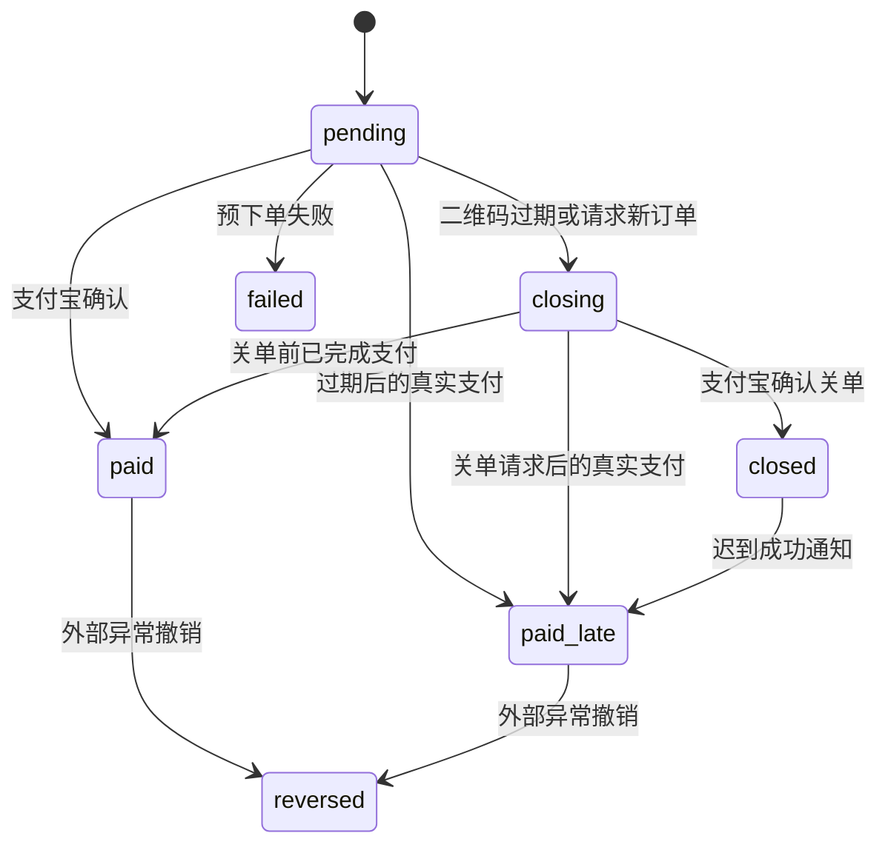
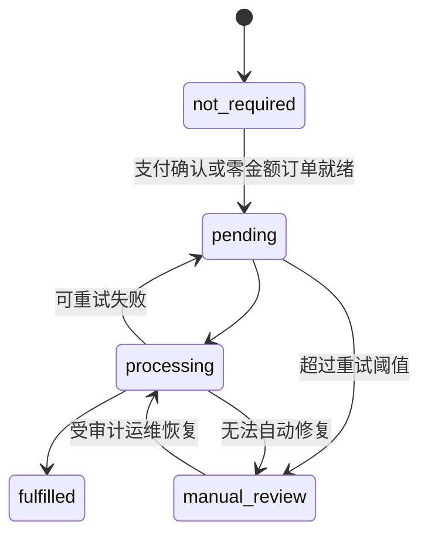
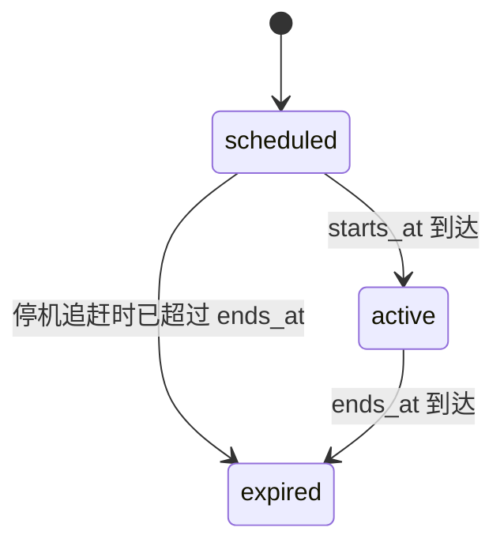
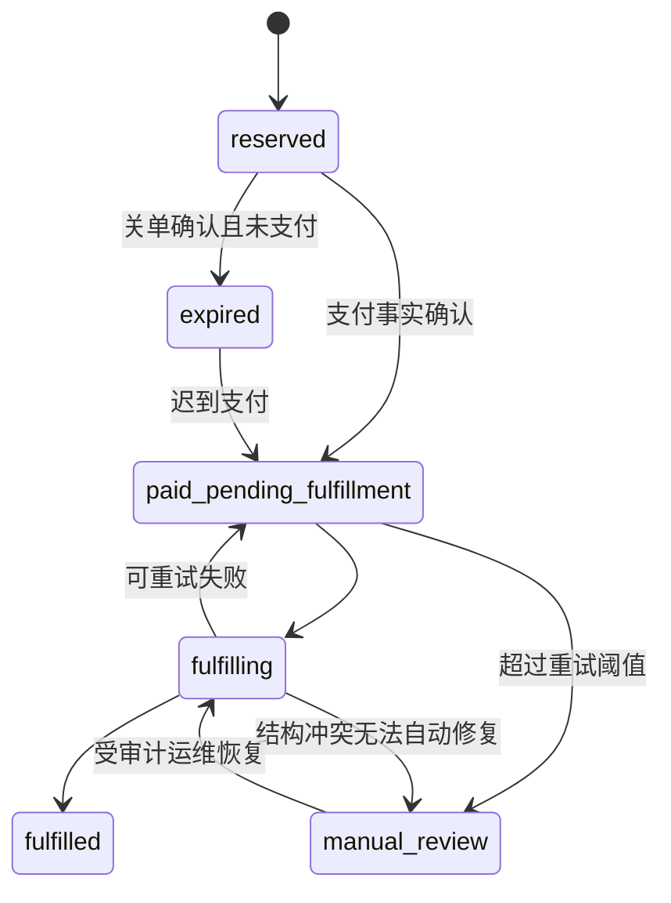
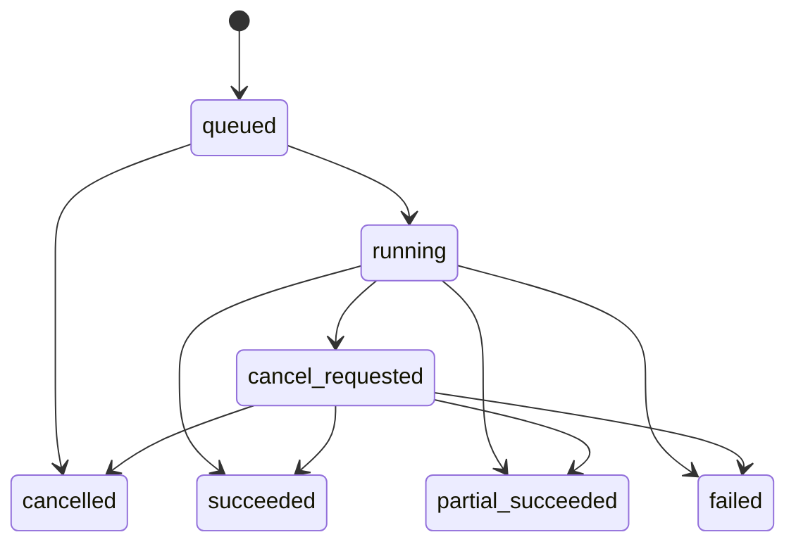
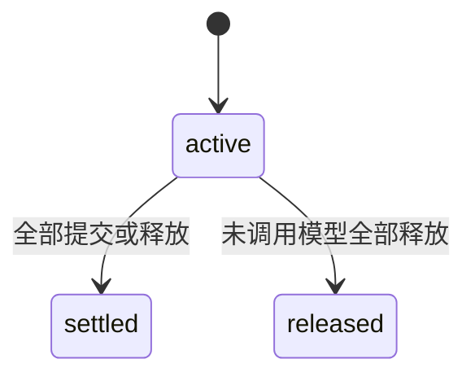

# ArtForge Studio 会员系统数据库设计

> 状态：设计基线，尚未创建 migration
> 版本：v0.1
> 记录日期：2026-07-14
> 数据库：MySQL 8 / InnoDB / utf8mb4
> 关联文档：[会员系统接入方案](./MEMBERSHIP_INTEGRATION_PLAN.md)

## 1. 设计目标

本设计覆盖以下服务端权威数据：

- 邮箱账号、设备会话和协议同意记录。
- 版本化会员套餐、会员周期、提前续费和升级补差。
- 注册赠送、会员赠送、充值积分的独立积分批次。
- 积分预占、结算、释放、过期和审计账本。
- 会员购买、升级、积分充值和支付宝支付回调。
- 版本化模型目录、清晰度权限和积分价格。
- 异步生成任务、单图执行结果、临时文件和交付确认。
- 到期提醒、配置同步、API 幂等和事务事件。

数据库必须保证：

1. 客户端不能直接决定会员、余额或订单状态。
2. 同一支付宝回调、任务请求或积分结算重复执行时，业务结果只发生一次。
3. 积分余额可以由批次和账本重建，不能只依赖一个可随意覆盖的余额字段。
4. 已成交订单锁定套餐、折扣、积分和模型价格快照。
5. 会员升级、支付入账和积分变化必须在 MySQL 事务中完成。

## 2. 通用约定

### 2.1 表与字段

- 表名使用复数 `snake_case`。
- 字段名使用 `snake_case`。
- 内部主键使用 `BIGINT UNSIGNED AUTO_INCREMENT`。
- 对外公开 ID 使用 `CHAR(36)` UUID，并建立唯一索引。
- 所有表使用 `ENGINE=InnoDB`。
- 字符集使用 `utf8mb4`，排序规则使用 `utf8mb4_general_ci`。
- 时间字段使用 `DATETIME(3)`，应用层统一按 UTC 写入。
- API 展示时再转换为用户时区，默认 `Asia/Shanghai`。
- 金额统一保存为人民币分，不使用 `FLOAT` 或 `DECIMAL` 参与核心结算。
- 积分统一使用 `BIGINT`，不允许浮点积分。
- 折扣使用基点表示，`10000` 表示原价，`9500` 表示 95 折。
- 状态字段使用 `VARCHAR(32)`，不使用 MySQL `ENUM`，便于后续 migration 扩展。
- 所有 JSON 快照在写入后视为不可变数据。

### 2.2 Node.js BIGINT 边界

MySQL `BIGINT` 可能超过 JavaScript `Number` 的安全整数上限，应用层统一执行以下规则：

- `mysql2`/Sequelize 开启 `supportBigNumbers` 和 `bigNumberStrings`，所有 `BIGINT` 字段读取为十进制字符串。
- 内部 ID、金额分、积分、成本微单位和游标禁止使用 `Number()` 转换，计算统一使用 `BigInt` 或只接受十进制字符串的整数工具。
- API 中的 `BIGINT` 一律序列化为十进制字符串；对外资源标识优先使用 UUID，客户端不得依赖内部自增 ID 做数值运算。
- JSON 快照中的金额、积分和内部 ID 同样保存为十进制字符串，避免 JSON 解析时丢失精度。
- Joi 校验使用十进制字符串正则和业务上限，不使用 JavaScript 数字上限校验 BIGINT。
- 数据库与 API 测试必须覆盖大于 `9007199254740991` 的 ID、积分和金额值。

### 2.3 时间字段

普通业务表默认包含：

```text
created_at DATETIME(3) NOT NULL
updated_at DATETIME(3) NOT NULL
```

账本、回调和审计事件属于追加写数据，只保留 `created_at`，不允许业务层修改历史记录。

### 2.4 删除策略

- 用户、订单、支付、会员周期和积分账本不做物理级联删除。
- 用户通过 `status` 禁用，不直接删除权威交易数据。
- 临时文件允许在 OSS 删除后更新为 `deleted` 或 `expired`。
- 内容清理只清空提示词、对象键等敏感内容，不删除任务结算事实。
- 外键默认使用 `ON DELETE RESTRICT`。

### 2.5 敏感数据

- 数据库不保存 refresh token 明文，只保存哈希。
- 邮箱建议使用可查询哈希 + 加密密文 + 脱敏展示值三列。
- 支付宝私钥、SMTP 密码、OSS Secret 和模型 API Key 不进入数据库。
- 支付回调只保存排查与审计所需字段，避免保存不必要的个人信息。
- IP 使用 `VARBINARY(16)` 兼容 IPv4 与 IPv6。

## 3. 核心关系

```mermaid
erDiagram
    USERS ||--o{ USER_SESSIONS : owns
    USER_SESSIONS ||--o{ SESSION_REFRESH_TOKENS : rotates
    USERS ||--o{ AGREEMENT_ACCEPTANCES : accepts
    USERS ||--o| REGISTRATION_GRANTS : receives
    USERS ||--o{ MEMBERSHIP_PERIODS : owns
    USERS ||--o{ MEMBERSHIP_OPERATIONS : serializes
    MEMBERSHIP_PLAN_VERSIONS ||--o{ MEMBERSHIP_PERIODS : defines
    MEMBERSHIP_PERIODS ||--o{ MEMBERSHIP_PERIOD_CHANGES : records
    USERS ||--o{ ORDERS : creates
    ORDERS ||--o| MEMBERSHIP_OPERATIONS : fulfills
    ORDERS ||--o{ ORDER_ITEMS : contains
    ORDERS ||--o{ PAYMENT_TRANSACTIONS : paid_by
    USERS ||--|| CREDIT_ACCOUNTS : has
    USERS ||--o{ CREDIT_LOTS : owns
    CREDIT_ACCOUNTS ||--o{ CREDIT_LEDGER : records
    CREDIT_RESERVATIONS ||--o{ CREDIT_RESERVATION_ITEMS : allocates
    CREDIT_LOTS ||--o{ CREDIT_RESERVATION_ITEMS : supplies
    USERS ||--o{ GENERATION_TASKS : submits
    GENERATION_TASKS ||--o{ GENERATION_TASK_ITEMS : contains
    GENERATION_TASKS ||--o{ TASK_FILES : uses
    MODEL_VERSIONS ||--o{ MODEL_QUALITY_PRICES : prices
    MODEL_VERSIONS ||--o{ GENERATION_TASKS : executes
    USERS ||--o{ OPERATION_AUDITS : affected_by
```



## 4. 账号与认证

### 4.1 `users`

账号主表。邮箱是登录身份，但不直接作为主键。

| 字段 | 类型 | 约束 | 说明 |
|---|---|---|---|
| `id` | BIGINT UNSIGNED | PK | 内部主键 |
| `public_id` | CHAR(36) | UNIQUE, NOT NULL | API 用户 ID |
| `email_lookup_hash` | BINARY(32) | UNIQUE, NOT NULL | 规范化邮箱的 HMAC-SHA256 |
| `email_ciphertext` | VARBINARY(512) | NOT NULL | 加密后的规范化邮箱 |
| `email_masked` | VARCHAR(254) | NOT NULL | 例如 `a***@example.com` |
| `nickname` | VARCHAR(64) | NULL | 用户昵称 |
| `status` | VARCHAR(32) | NOT NULL | `active`、`disabled` |
| `registered_at` | DATETIME(3) | NOT NULL | 注册时间 |
| `last_login_at` | DATETIME(3) | NULL | 最近登录时间 |
| `membership_revision` | BIGINT UNSIGNED | NOT NULL DEFAULT 0 | 会员周期结构变更版本，不因派生状态刷新而增加 |
| `version` | INT UNSIGNED | NOT NULL DEFAULT 0 | 乐观锁版本 |
| `created_at` | DATETIME(3) | NOT NULL | 创建时间 |
| `updated_at` | DATETIME(3) | NOT NULL | 更新时间 |

索引：

- `UNIQUE(email_lookup_hash)`：登录查询与防止重复注册。
- `INDEX(status, created_at)`：运营与异常账号查询。

邮箱规范化建议：去除首尾空白，域名转小写；本地部分是否转小写由统一函数决定，注册和登录必须使用同一算法。

### 4.2 `user_sessions`

每次设备登录对应一条会话。允许无限设备，不建立用户与设备的数量限制。

| 字段 | 类型 | 约束 | 说明 |
|---|---|---|---|
| `id` | BIGINT UNSIGNED | PK | 内部主键 |
| `public_id` | CHAR(36) | UNIQUE, NOT NULL | 会话 ID |
| `user_id` | BIGINT UNSIGNED | FK, NOT NULL | 所属用户 |
| `token_family_id` | CHAR(36) | NOT NULL | refresh token 轮换族 |
| `current_refresh_token_id` | BIGINT UNSIGNED | FK, NULL | 当前有效 token；登录事务创建 token 后回填 |
| `device_id_hash` | BINARY(32) | NOT NULL | 客户端设备 ID 哈希 |
| `device_name` | VARCHAR(128) | NULL | 用户可识别设备名 |
| `platform` | VARCHAR(32) | NOT NULL | `windows`、`macos` |
| `app_version` | VARCHAR(32) | NOT NULL | 登录时客户端版本 |
| `ip_address` | VARBINARY(16) | NULL | 最近 IP |
| `user_agent` | VARCHAR(512) | NULL | 客户端标识 |
| `expires_at` | DATETIME(3) | NOT NULL | refresh token 到期时间 |
| `last_seen_at` | DATETIME(3) | NOT NULL | 最近刷新或请求时间 |
| `revoked_at` | DATETIME(3) | NULL | 撤销时间 |
| `revoke_reason` | VARCHAR(64) | NULL | `logout`、`logout_all`、`reuse_detected` 等 |
| `created_at` | DATETIME(3) | NOT NULL | 创建时间 |
| `updated_at` | DATETIME(3) | NOT NULL | 更新时间 |

索引：

- `INDEX(user_id, revoked_at, expires_at)`：列出有效设备会话。
- `UNIQUE(token_family_id)`：一个设备会话对应一个独立 token family。
- `INDEX(device_id_hash, created_at)`：注册赠送风控辅助查询。

### 4.3 `session_refresh_tokens`

保存 refresh token 哈希历史。明文 token 只在创建或轮换成功的响应中返回一次，不进入数据库和日志。

| 字段 | 类型 | 约束 | 说明 |
|---|---|---|---|
| `id` | BIGINT UNSIGNED | PK | 主键 |
| `session_id` | BIGINT UNSIGNED | FK, NOT NULL | 所属设备会话 |
| `token_hash` | BINARY(32) | UNIQUE, NOT NULL | refresh token 的 HMAC-SHA256 |
| `parent_token_id` | BIGINT UNSIGNED | FK, NULL | 被本 token 替换的上一枚 token |
| `status` | VARCHAR(32) | NOT NULL | `active`、`rotated`、`revoked`、`reused` |
| `issued_at` | DATETIME(3) | NOT NULL | 签发时间 |
| `expires_at` | DATETIME(3) | NOT NULL | 到期时间 |
| `rotated_at` | DATETIME(3) | NULL | 被正常轮换时间 |
| `revoked_at` | DATETIME(3) | NULL | 撤销时间 |
| `reuse_detected_at` | DATETIME(3) | NULL | 发现旧 token 重放时间 |
| `created_at` | DATETIME(3) | NOT NULL | 写入时间 |
| `updated_at` | DATETIME(3) | NOT NULL | 更新时间 |

索引与约束：

- `UNIQUE(token_hash)`。
- `UNIQUE(parent_token_id)`：同一旧 token 只能生成一个后继 token；MySQL 允许多个 NULL。
- `INDEX(session_id, status, expires_at)`。

刷新时先按哈希锁定 token 和会话。只有 `active` 且等于 `user_sessions.current_refresh_token_id` 的 token 可以生成后继；事务内插入新 token、将旧 token 标记为 `rotated` 并更新当前 token ID。已经 `rotated` 的 token 再次出现时标记为 `reused`，撤销整个 token family 及其全部 token。并发刷新由行锁和 `UNIQUE(parent_token_id)` 保证只能成功一次。

### 4.4 `agreement_versions`

保存需要用户同意的协议版本元数据，不保存完整协议正文也可以，但必须保存内容哈希和可追溯 URL。

| 字段 | 类型 | 约束 | 说明 |
|---|---|---|---|
| `id` | BIGINT UNSIGNED | PK | 主键 |
| `agreement_type` | VARCHAR(32) | NOT NULL | `user`、`privacy`、`membership`、`credit` |
| `version` | VARCHAR(32) | NOT NULL | 协议版本 |
| `title` | VARCHAR(128) | NOT NULL | 展示标题 |
| `content_url` | VARCHAR(1024) | NOT NULL | 协议地址 |
| `content_sha256` | BINARY(32) | NOT NULL | 内容哈希 |
| `required` | TINYINT(1) | NOT NULL DEFAULT 1 | 是否必须同意 |
| `effective_at` | DATETIME(3) | NOT NULL | 生效时间 |
| `retired_at` | DATETIME(3) | NULL | 停用时间 |
| `created_at` | DATETIME(3) | NOT NULL | 创建时间 |
| `updated_at` | DATETIME(3) | NOT NULL | 更新时间 |

唯一索引：`UNIQUE(agreement_type, version)`。

### 4.5 `agreement_acceptances`

| 字段 | 类型 | 约束 | 说明 |
|---|---|---|---|
| `id` | BIGINT UNSIGNED | PK | 主键 |
| `user_id` | BIGINT UNSIGNED | FK, NOT NULL | 用户 |
| `agreement_version_id` | BIGINT UNSIGNED | FK, NOT NULL | 协议版本 |
| `device_id_hash` | BINARY(32) | NOT NULL | 同意时设备 |
| `ip_address` | VARBINARY(16) | NULL | 同意时 IP |
| `accepted_at` | DATETIME(3) | NOT NULL | 同意时间 |
| `created_at` | DATETIME(3) | NOT NULL | 写入时间 |

唯一索引：`UNIQUE(user_id, agreement_version_id)`。

### 4.6 `registration_grants`

记录注册赠送资格与结果。每个用户只允许一条最终决策。

| 字段 | 类型 | 约束 | 说明 |
|---|---|---|---|
| `id` | BIGINT UNSIGNED | PK | 主键 |
| `user_id` | BIGINT UNSIGNED | UNIQUE, FK, NOT NULL | 用户 |
| `device_id_hash` | BINARY(32) | NOT NULL | 注册设备 |
| `ip_address` | VARBINARY(16) | NULL | 注册 IP |
| `decision` | VARCHAR(32) | NOT NULL | `granted`、`denied` |
| `decision_reason` | VARCHAR(64) | NOT NULL | `eligible`、`device_limit`、`ip_limit`、`disposable_email` |
| `credit_amount` | BIGINT UNSIGNED | NOT NULL DEFAULT 0 | 实际赠送积分 |
| `credit_lot_id` | BIGINT UNSIGNED | FK, NULL | 对应积分批次 |
| `quota_snapshot` | JSON | NOT NULL | 设备/IP 配额键、窗口、限制与裁决结果 |
| `decided_at` | DATETIME(3) | NOT NULL | 决策时间 |
| `created_at` | DATETIME(3) | NOT NULL | 创建时间 |

索引：

- `INDEX(device_id_hash, decided_at, decision)`。
- `INDEX(ip_address, decided_at, decision)`。

注册、配额占用、风控记录、100 积分批次和账本记录必须在同一事务中完成。

### 4.7 `registration_grant_quota_buckets`

注册赠送属于有价值权益，设备终身上限和 IP 每日上限由 MySQL 原子裁决。Redis 计数只可用于请求预筛选，不能作为最终依据。

| 字段 | 类型 | 约束 | 说明 |
|---|---|---|---|
| `id` | BIGINT UNSIGNED | PK | 主键 |
| `scope_type` | VARCHAR(32) | NOT NULL | `device_lifetime`、`ip_day` |
| `scope_hash` | BINARY(32) | NOT NULL | 设备 ID 或规范化 IP 的 HMAC-SHA256 |
| `window_key` | VARCHAR(16) | NOT NULL | 设备使用 `lifetime`，IP 使用 UTC 日期 `YYYY-MM-DD` |
| `limit_count` | INT UNSIGNED | NOT NULL | 创建桶时锁定的上限快照 |
| `granted_count` | INT UNSIGNED | NOT NULL DEFAULT 0 | 已成功发放数量 |
| `version` | INT UNSIGNED | NOT NULL DEFAULT 0 | 乐观锁版本 |
| `created_at` | DATETIME(3) | NOT NULL | 创建时间 |
| `updated_at` | DATETIME(3) | NOT NULL | 更新时间 |

唯一索引：`UNIQUE(scope_type, scope_hash, window_key)`。事务按 `scope_type, scope_hash, window_key` 排序后锁定设备桶和 IP 桶，资格通过时在同一事务内增加 `granted_count`；事务回滚不会消耗额度。

## 5. 版本化商品配置

### 5.1 `membership_plan_versions`

套餐配置由 YAML 同步到数据库。版本写入后不可原地修改，只能创建新版本。

| 字段 | 类型 | 约束 | 说明 |
|---|---|---|---|
| `id` | BIGINT UNSIGNED | PK | 主键 |
| `plan_code` | VARCHAR(32) | NOT NULL | `free`、`basic`、`advanced`、`professional` |
| `version` | INT UNSIGNED | NOT NULL | 套餐版本号 |
| `display_name` | VARCHAR(64) | NOT NULL | 展示名称 |
| `tier_rank` | SMALLINT UNSIGNED | NOT NULL | 0、10、20、30 |
| `price_cents` | BIGINT UNSIGNED | NOT NULL | 30 天价格，免费为 0 |
| `period_days` | SMALLINT UNSIGNED | NOT NULL DEFAULT 30 | 周期天数 |
| `grant_credits` | BIGINT UNSIGNED | NOT NULL | 周期赠送积分 |
| `recharge_discount_bps` | SMALLINT UNSIGNED | NOT NULL | 10000、9500、9000、8500 |
| `max_quality` | VARCHAR(16) | NOT NULL | `1K`、`2K`、`4K` |
| `is_available` | TINYINT(1) | NOT NULL DEFAULT 1 | 是否允许新购买 |
| `effective_at` | DATETIME(3) | NOT NULL | 生效时间 |
| `retired_at` | DATETIME(3) | NULL | 停止新购时间 |
| `config_sha256` | BINARY(32) | NOT NULL | YAML 配置哈希 |
| `snapshot` | JSON | NOT NULL | 完整权益快照 |
| `created_at` | DATETIME(3) | NOT NULL | 创建时间 |

唯一索引：

- `UNIQUE(plan_code, version)`。
- `UNIQUE(config_sha256)`。

首版种子数据：

| plan_code | price_cents | grant_credits | discount_bps | max_quality |
|---|---:|---:|---:|---|
| free | 0 | 0 | 10000 | 1K |
| basic | 1900 | 2000 | 9500 | 2K |
| advanced | 3900 | 4200 | 9000 | 4K |
| professional | 5900 | 6500 | 8500 | 4K |

免费注册赠送 100 积分不放在免费套餐版本中，由 `registration_grants` 单独控制。

### 5.2 `credit_pack_versions`

| 字段 | 类型 | 约束 | 说明 |
|---|---|---|---|
| `id` | BIGINT UNSIGNED | PK | 主键 |
| `pack_code` | VARCHAR(32) | NOT NULL | 充值包编码 |
| `version` | INT UNSIGNED | NOT NULL | 版本号 |
| `display_name` | VARCHAR(64) | NOT NULL | 展示名称 |
| `price_cents` | BIGINT UNSIGNED | NOT NULL | 原价 |
| `credits` | BIGINT UNSIGNED | NOT NULL | 充值积分 |
| `is_available` | TINYINT(1) | NOT NULL DEFAULT 1 | 是否可购买 |
| `effective_at` | DATETIME(3) | NOT NULL | 生效时间 |
| `retired_at` | DATETIME(3) | NULL | 停止购买时间 |
| `config_sha256` | BINARY(32) | NOT NULL | 配置哈希 |
| `created_at` | DATETIME(3) | NOT NULL | 创建时间 |

唯一索引：`UNIQUE(pack_code, version)`。

首版种子数据：

| pack_code | price_cents | credits |
|---|---:|---:|
| pack_1000 | 1000 | 1000 |
| pack_5000 | 5000 | 5000 |
| pack_10000 | 10000 | 10000 |
| pack_30000 | 30000 | 30000 |

### 5.3 `model_versions`

模型配置按版本保存，任务引用具体版本，避免调价后历史任务含义变化。

| 字段 | 类型 | 约束 | 说明 |
|---|---|---|---|
| `id` | BIGINT UNSIGNED | PK | 主键 |
| `model_code` | VARCHAR(64) | NOT NULL | 稳定业务编码 |
| `version` | INT UNSIGNED | NOT NULL | 配置版本 |
| `purpose` | VARCHAR(32) | NOT NULL | `image`、`prompt` |
| `display_name` | VARCHAR(128) | NOT NULL | 客户端名称 |
| `provider_protocol` | VARCHAR(32) | NOT NULL | 首版固定 `openai` |
| `provider_model_id` | VARCHAR(256) | NOT NULL | 上游模型 ID，不含 API Key |
| `endpoint_ref` | VARCHAR(64) | NOT NULL | 环境变量配置引用名 |
| `is_available` | TINYINT(1) | NOT NULL DEFAULT 1 | 是否允许新任务 |
| `config_sha256` | BINARY(32) | NOT NULL | 配置哈希 |
| `capability_snapshot` | JSON | NOT NULL | 模型能力快照 |
| `effective_at` | DATETIME(3) | NOT NULL | 生效时间 |
| `retired_at` | DATETIME(3) | NULL | 下线时间 |
| `created_at` | DATETIME(3) | NOT NULL | 创建时间 |

唯一索引：`UNIQUE(model_code, version)`。

### 5.4 `model_quality_prices`

| 字段 | 类型 | 约束 | 说明 |
|---|---|---|---|
| `id` | BIGINT UNSIGNED | PK | 主键 |
| `model_version_id` | BIGINT UNSIGNED | FK, NOT NULL | 模型版本 |
| `quality` | VARCHAR(16) | NOT NULL | `1K`、`2K`、`4K` 或 `default` |
| `max_long_edge` | INT UNSIGNED | NULL | 图片最长边 |
| `credit_cost` | BIGINT UNSIGNED | NOT NULL | 每张或每次积分 |
| `is_available` | TINYINT(1) | NOT NULL DEFAULT 1 | 是否开放 |
| `created_at` | DATETIME(3) | NOT NULL | 创建时间 |

唯一索引：`UNIQUE(model_version_id, quality)`。

### 5.5 `config_sync_versions`

记录 YAML 配置同步结果，避免错误配置被无声覆盖。

| 字段 | 类型 | 约束 | 说明 |
|---|---|---|---|
| `id` | BIGINT UNSIGNED | PK | 主键 |
| `config_type` | VARCHAR(32) | NOT NULL | `membership`、`credit_pack`、`model`、`client_version` |
| `version` | VARCHAR(64) | NOT NULL | 配置版本 |
| `config_sha256` | BINARY(32) | NOT NULL | 文件哈希 |
| `environment` | VARCHAR(16) | NOT NULL | `dev`、`prod` |
| `sync_status` | VARCHAR(32) | NOT NULL | `success`、`failed` |
| `error_message` | VARCHAR(1024) | NULL | 失败原因 |
| `synced_at` | DATETIME(3) | NOT NULL | 同步时间 |
| `created_at` | DATETIME(3) | NOT NULL | 写入时间 |

唯一索引：`UNIQUE(config_type, version, environment)`。

## 6. 会员周期与升级

### 6.1 `membership_periods`

付费会员的每个 30 天周期一行。免费会员不创建周期，无有效付费周期时自动按当前免费套餐处理。

| 字段 | 类型 | 约束 | 说明 |
|---|---|---|---|
| `id` | BIGINT UNSIGNED | PK | 主键 |
| `public_id` | CHAR(36) | UNIQUE, NOT NULL | API 周期 ID |
| `user_id` | BIGINT UNSIGNED | FK, NOT NULL | 用户 |
| `plan_version_id` | BIGINT UNSIGNED | FK, NOT NULL | 当前套餐版本 |
| `source_order_item_id` | BIGINT UNSIGNED | FK, NOT NULL | 创建该周期的订单项 |
| `sequence_no` | INT UNSIGNED | NOT NULL | 用户会员周期顺序 |
| `starts_at` | DATETIME(3) | NOT NULL | 周期开始 |
| `ends_at` | DATETIME(3) | NOT NULL | 周期结束，不含该时刻 |
| `status` | VARCHAR(32) | NOT NULL | `scheduled`、`active`、`expired` |
| `grant_credits_snapshot` | BIGINT UNSIGNED | NOT NULL | 本周期应发积分 |
| `discount_bps_snapshot` | SMALLINT UNSIGNED | NOT NULL | 本周期充值折扣 |
| `max_quality_snapshot` | VARCHAR(16) | NOT NULL | 本周期清晰度权限 |
| `entitlement_snapshot` | JSON | NOT NULL | 完整权益快照 |
| `credit_lot_id` | BIGINT UNSIGNED | FK, NULL | 已发放积分批次 |
| `activated_at` | DATETIME(3) | NULL | 实际激活时间 |
| `credits_granted_at` | DATETIME(3) | NULL | 积分发放时间 |
| `expired_at` | DATETIME(3) | NULL | 实际过期处理时间 |
| `version` | INT UNSIGNED | NOT NULL DEFAULT 0 | 乐观锁版本 |
| `created_at` | DATETIME(3) | NOT NULL | 创建时间 |
| `updated_at` | DATETIME(3) | NOT NULL | 更新时间 |

索引与约束：

- `UNIQUE(user_id, sequence_no)`。
- `INDEX(user_id, status, starts_at, ends_at)`。
- `INDEX(user_id, starts_at, ends_at)`：不依赖派生状态查询当前事实周期。
- `CHECK(ends_at > starts_at)`。
- 同一用户周期不得重叠，该约束由事务逻辑在 `SELECT ... FOR UPDATE` 后校验。

提前续费时，新周期从用户最后一个周期的 `ends_at` 开始，没有累计上限。

`starts_at <= now < ends_at` 是当前会员判定的权威条件。`status`、`activated_at` 和 `expired_at` 用于查询加速与运维观察，允许由幂等追赶任务重建；仅刷新这些派生字段时不增加 `users.membership_revision`。周期创建、套餐升级、起止时间修正等结构变化必须在锁定用户后增加 `membership_revision`。

### 6.2 `membership_period_changes`

记录套餐购买、续费和升级造成的周期变更。该表追加写，不允许修改历史记录。

| 字段 | 类型 | 约束 | 说明 |
|---|---|---|---|
| `id` | BIGINT UNSIGNED | PK | 主键 |
| `membership_period_id` | BIGINT UNSIGNED | FK, NOT NULL | 被变更周期 |
| `user_id` | BIGINT UNSIGNED | FK, NOT NULL | 用户 |
| `change_type` | VARCHAR(32) | NOT NULL | `purchase`、`renewal`、`upgrade` |
| `order_item_id` | BIGINT UNSIGNED | FK, NOT NULL | 对应订单项 |
| `from_plan_version_id` | BIGINT UNSIGNED | FK, NULL | 升级前版本 |
| `to_plan_version_id` | BIGINT UNSIGNED | FK, NOT NULL | 购买或升级后版本 |
| `price_delta_cents` | BIGINT UNSIGNED | NOT NULL | 本周期支付金额 |
| `grant_credit_delta` | BIGINT UNSIGNED | NOT NULL | 本周期增加的赠送积分 |
| `remaining_seconds` | BIGINT UNSIGNED | NULL | 当前周期升级剩余秒数 |
| `change_snapshot` | JSON | NOT NULL | 计算参数与舍入结果 |
| `changed_at` | DATETIME(3) | NOT NULL | 变更时间 |
| `created_at` | DATETIME(3) | NOT NULL | 写入时间 |

索引：`INDEX(membership_period_id, changed_at)`。

### 6.3 `membership_upgrade_quotes`

升级报价由后端生成，客户端不能提交自算差价。报价建议 5 分钟有效。

| 字段 | 类型 | 约束 | 说明 |
|---|---|---|---|
| `id` | BIGINT UNSIGNED | PK | 主键 |
| `public_id` | CHAR(36) | UNIQUE, NOT NULL | 报价 ID |
| `user_id` | BIGINT UNSIGNED | FK, NOT NULL | 用户 |
| `target_plan_version_id` | BIGINT UNSIGNED | FK, NOT NULL | 目标套餐 |
| `status` | VARCHAR(32) | NOT NULL | `active`、`consumed`、`expired` |
| `total_original_cents` | BIGINT UNSIGNED | NOT NULL | 补差原金额 |
| `total_payable_cents` | BIGINT UNSIGNED | NOT NULL | 应付金额 |
| `total_credit_delta` | BIGINT UNSIGNED | NOT NULL | 补发积分总额 |
| `quote_snapshot` | JSON | NOT NULL | 全部周期报价快照 |
| `expires_at` | DATETIME(3) | NOT NULL | 报价过期时间 |
| `consumed_order_id` | BIGINT UNSIGNED | FK, NULL | 使用该报价的订单 |
| `created_at` | DATETIME(3) | NOT NULL | 创建时间 |
| `updated_at` | DATETIME(3) | NOT NULL | 更新时间 |

索引：`INDEX(user_id, status, expires_at)`。

创建升级订单时必须在一个事务中锁定报价，将状态从 `active` 改为 `consumed`，并回填 `consumed_order_id`。报价过期只阻止创建新订单；订单创建后由订单自己的二维码有效期控制支付。

### 6.4 `membership_upgrade_quote_items`

升级必须转换当前周期和全部未来周期，因此每个周期保存一行报价明细。

| 字段 | 类型 | 约束 | 说明 |
|---|---|---|---|
| `id` | BIGINT UNSIGNED | PK | 主键 |
| `quote_id` | BIGINT UNSIGNED | FK, NOT NULL | 升级报价 |
| `membership_period_id` | BIGINT UNSIGNED | FK, NOT NULL | 被升级周期 |
| `from_plan_version_id` | BIGINT UNSIGNED | FK, NOT NULL | 原套餐 |
| `to_plan_version_id` | BIGINT UNSIGNED | FK, NOT NULL | 新套餐 |
| `period_version_snapshot` | INT UNSIGNED | NOT NULL | 创建报价时的周期版本 |
| `remaining_seconds` | BIGINT UNSIGNED | NOT NULL | 当前周期按剩余时间，未来周期为完整周期 |
| `price_delta_cents` | BIGINT UNSIGNED | NOT NULL | 本周期补差 |
| `credit_delta` | BIGINT UNSIGNED | NOT NULL | 本周期补发积分 |
| `calculation_snapshot` | JSON | NOT NULL | 计算公式与舍入结果 |
| `created_at` | DATETIME(3) | NOT NULL | 创建时间 |

唯一索引：`UNIQUE(quote_id, membership_period_id)`。

升级差额按以下固定规则计算并写入 `calculation_snapshot`：

- 金额分子为 `max(target_price_cents - source_price_cents_snapshot, 0) * remaining_seconds`，分母为周期总秒数，最终人民币分采用四舍五入且恰好半分时向上取整。
- 积分分子为 `max(target_grant_credits - source_grant_credits_snapshot, 0) * remaining_seconds`，除以周期总秒数后向下取整。
- 未来完整周期使用完整差额；不因历史套餐价格或赠送积分更高而产生负数、退款或扣回。
- 单个正数金额结果不足 1 分时按 1 分；整单金额为 0 时不创建支付宝交易，直接创建并兑现零金额会员操作。
- 快照保存源值、目标值、分子、分母、舍入模式和最终结果，所有值使用十进制字符串。

### 6.5 `membership_operations`

冻结已经下单的会员变更意图，并将“支付事实”和“权益兑现”解耦。购买、续费和升级都必须先创建会员操作，同一用户同时只能存在一个占用会员变更槽位的操作。

| 字段 | 类型 | 约束 | 说明 |
|---|---|---|---|
| `id` | BIGINT UNSIGNED | PK | 主键 |
| `public_id` | CHAR(36) | UNIQUE, NOT NULL | API 操作 ID |
| `user_id` | BIGINT UNSIGNED | FK, NOT NULL | 用户 |
| `order_id` | BIGINT UNSIGNED | UNIQUE, FK, NOT NULL | 对应订单 |
| `operation_type` | VARCHAR(32) | NOT NULL | `purchase`、`renewal`、`upgrade` |
| `status` | VARCHAR(32) | NOT NULL | `reserved`、`paid_pending_fulfillment`、`fulfilling`、`fulfilled`、`expired`、`manual_review` |
| `active_slot` | TINYINT UNSIGNED | NULL | `reserved`、待兑现、兑现中和人工复核时为 1；`fulfilled/expired` 为 NULL |
| `base_membership_revision` | BIGINT UNSIGNED | NOT NULL | 创建订单时的会员结构版本 |
| `operation_snapshot` | JSON | NOT NULL | 待创建或变更周期、价格、积分和报价明细 |
| `reserved_until` | DATETIME(3) | NOT NULL | 正常支付占位截止时间 |
| `paid_at` | DATETIME(3) | NULL | 支付平台确认时间 |
| `fulfillment_attempts` | INT UNSIGNED | NOT NULL DEFAULT 0 | 兑现尝试次数 |
| `next_attempt_at` | DATETIME(3) | NULL | 下次恢复时间 |
| `fulfilled_at` | DATETIME(3) | NULL | 权益全部兑现时间 |
| `last_error` | VARCHAR(1024) | NULL | 脱敏失败信息 |
| `created_at` | DATETIME(3) | NOT NULL | 创建时间 |
| `updated_at` | DATETIME(3) | NOT NULL | 更新时间 |

索引与约束：

- `UNIQUE(order_id)`。
- `UNIQUE(user_id, active_slot)`：利用 MySQL 唯一索引允许多个 NULL，保证每个用户至多一个占用槽位的操作。
- `INDEX(status, next_attempt_at, id)`：恢复扫描。

创建订单时锁定 `users` 和全部未结束周期，校验报价与 `membership_revision` 后写入不可变操作快照，并占用 `active_slot=1`。占位期间新的会员购买、续费或升级请求返回已有操作，不允许并行创建。周期激活和过期状态刷新不改变会员结构版本，也不使操作失效。

正常支付成功后按操作快照兑现，不再以报价是否过期或普通状态字段变化拒绝付款。若发现异常结构变化，订单仍保持已支付，操作进入 `paid_pending_fulfillment` 并由恢复任务重试；超过阈值进入 `manual_review`。迟到支付恢复时优先处理真实收款，必要时先关闭同用户尚未支付的新操作，再重新占用会员变更槽位。

## 7. 订单与支付

### 7.1 `orders`

| 字段 | 类型 | 约束 | 说明 |
|---|---|---|---|
| `id` | BIGINT UNSIGNED | PK | 主键 |
| `public_id` | CHAR(36) | UNIQUE, NOT NULL | API 订单 ID |
| `order_no` | VARCHAR(64) | UNIQUE, NOT NULL | 商户订单号 |
| `user_id` | BIGINT UNSIGNED | FK, NOT NULL | 用户 |
| `order_type` | VARCHAR(32) | NOT NULL | `membership_purchase`、`membership_renewal`、`membership_upgrade`、`credit_recharge` |
| `status` | VARCHAR(32) | NOT NULL | `pending`、`closing`、`paid`、`paid_late`、`closed`、`failed`、`reversed` |
| `fulfillment_status` | VARCHAR(32) | NOT NULL | `pending`、`processing`、`fulfilled`、`manual_review`、`not_required` |
| `currency` | CHAR(3) | NOT NULL DEFAULT 'CNY' | 币种 |
| `original_amount_cents` | BIGINT UNSIGNED | NOT NULL | 原金额 |
| `discount_amount_cents` | BIGINT UNSIGNED | NOT NULL DEFAULT 0 | 折扣金额 |
| `payable_amount_cents` | BIGINT UNSIGNED | NOT NULL | 实付金额 |
| `membership_period_id` | BIGINT UNSIGNED | FK, NULL | 下单时有效会员周期 |
| `plan_version_id` | BIGINT UNSIGNED | FK, NULL | 下单时会员版本 |
| `upgrade_quote_id` | BIGINT UNSIGNED | FK, NULL | 升级报价 |
| `business_snapshot` | JSON | NOT NULL | 商品、权益、折扣和价格快照 |
| `client_request_id` | VARCHAR(64) | NOT NULL | 客户端幂等请求号 |
| `expires_at` | DATETIME(3) | NOT NULL | 二维码订单过期时间 |
| `paid_at` | DATETIME(3) | NULL | 支付时间 |
| `closed_at` | DATETIME(3) | NULL | 关闭时间 |
| `fulfillment_attempts` | INT UNSIGNED | NOT NULL DEFAULT 0 | 权益兑现尝试次数 |
| `next_fulfillment_at` | DATETIME(3) | NULL | 下次兑现重试时间 |
| `fulfilled_at` | DATETIME(3) | NULL | 权益全部兑现时间 |
| `fulfillment_error` | VARCHAR(1024) | NULL | 脱敏兑现错误 |
| `failure_code` | VARCHAR(64) | NULL | 失败原因编码 |
| `created_at` | DATETIME(3) | NOT NULL | 创建时间 |
| `updated_at` | DATETIME(3) | NOT NULL | 更新时间 |

索引与约束：

- `UNIQUE(user_id, client_request_id)`。
- `INDEX(user_id, status, created_at)`。
- `INDEX(status, expires_at)`：关闭过期订单。
- `INDEX(fulfillment_status, next_fulfillment_at, id)`：恢复已支付待兑现订单。
- `CHECK(payable_amount_cents + discount_amount_cents = original_amount_cents)`。

有支付交易的订单创建时 `fulfillment_status=not_required`，支付事实确认后改为 `pending`；零金额升级不创建支付交易，订单创建后直接进入 `pending` 并执行会员兑现事务。恢复扫描只处理支付状态为 `paid/paid_late` 且兑现状态未完成的订单。

### 7.2 `order_items`

一个升级订单可能包含多个会员周期补差项，因此不能只使用订单头 JSON。

| 字段 | 类型 | 约束 | 说明 |
|---|---|---|---|
| `id` | BIGINT UNSIGNED | PK | 主键 |
| `order_id` | BIGINT UNSIGNED | FK, NOT NULL | 订单 |
| `item_type` | VARCHAR(32) | NOT NULL | `membership_period`、`membership_upgrade`、`credit_pack` |
| `item_code` | VARCHAR(64) | NOT NULL | 套餐或充值包编码 |
| `quantity` | INT UNSIGNED | NOT NULL DEFAULT 1 | 数量 |
| `original_amount_cents` | BIGINT UNSIGNED | NOT NULL | 原金额 |
| `discount_amount_cents` | BIGINT UNSIGNED | NOT NULL DEFAULT 0 | 折扣金额 |
| `payable_amount_cents` | BIGINT UNSIGNED | NOT NULL | 实付金额 |
| `credit_amount` | BIGINT UNSIGNED | NOT NULL DEFAULT 0 | 发放或补发积分 |
| `target_period_id` | BIGINT UNSIGNED | FK, NULL | 升级目标周期 |
| `item_snapshot` | JSON | NOT NULL | 不可变商品快照 |
| `created_at` | DATETIME(3) | NOT NULL | 创建时间 |

索引：`INDEX(order_id, id)`。

### 7.3 `payment_transactions`

保存支付宝交易事实。首版不提供现金退款，但保留 `reversed` 以处理外部异常撤销。

| 字段 | 类型 | 约束 | 说明 |
|---|---|---|---|
| `id` | BIGINT UNSIGNED | PK | 主键 |
| `public_id` | CHAR(36) | UNIQUE, NOT NULL | 支付记录 ID |
| `order_id` | BIGINT UNSIGNED | FK, NOT NULL | 订单 |
| `provider` | VARCHAR(32) | NOT NULL | `alipay` |
| `provider_trade_no` | VARCHAR(128) | UNIQUE, NULL | 支付宝交易号 |
| `channel` | VARCHAR(32) | NOT NULL | `precreate_qr` |
| `status` | VARCHAR(32) | NOT NULL | `created`、`closing`、`paid`、`paid_late`、`closed`、`failed`、`reversed` |
| `amount_cents` | BIGINT UNSIGNED | NOT NULL | 支付金额 |
| `qr_payload_ciphertext` | VARBINARY(2048) | NULL | 5 分钟二维码内容，可不长期保留 |
| `qr_expires_at` | DATETIME(3) | NULL | 二维码过期时间 |
| `close_requested_at` | DATETIME(3) | NULL | 请求支付宝关单时间 |
| `closed_at` | DATETIME(3) | NULL | 支付宝确认关闭时间 |
| `paid_at` | DATETIME(3) | NULL | 支付平台确认成功时间 |
| `provider_payload` | JSON | NULL | 脱敏后的关键支付字段 |
| `created_at` | DATETIME(3) | NOT NULL | 创建时间 |
| `updated_at` | DATETIME(3) | NOT NULL | 更新时间 |

约束：一个订单首版只允许一个支付记录，使用 `UNIQUE(order_id)`。二维码过期或重新下单时先将交易改为 `closing` 并调用支付宝关单；只有支付宝确认关闭或确认交易不存在后，订单和交易才能改为 `closed`，随后才允许创建新订单。

验签通过的成功通知始终优先于本地关闭状态。支付发生在二维码过期、关单请求之后或本地已关闭时，记录真实交易号和支付时间，将订单及交易标记为 `paid_late`，不能返回“未支付”或丢弃通知。

### 7.4 `payment_notifications`

支付宝可能重复通知，通知必须先落库再执行业务。

| 字段 | 类型 | 约束 | 说明 |
|---|---|---|---|
| `id` | BIGINT UNSIGNED | PK | 主键 |
| `provider` | VARCHAR(32) | NOT NULL | `alipay` |
| `notification_hash` | BINARY(32) | UNIQUE, NOT NULL | 规范化通知内容哈希 |
| `order_no` | VARCHAR(64) | NULL | 商户订单号 |
| `provider_trade_no` | VARCHAR(128) | NULL | 支付宝交易号 |
| `trade_status` | VARCHAR(64) | NULL | 上游交易状态 |
| `amount_cents` | BIGINT UNSIGNED | NULL | 通知金额 |
| `signature_verified` | TINYINT(1) | NOT NULL DEFAULT 0 | 是否验签通过 |
| `process_status` | VARCHAR(32) | NOT NULL | `received`、`payment_recorded`、`processed`、`rejected`、`failed` |
| `reject_reason` | VARCHAR(128) | NULL | 验签或业务拒绝原因 |
| `attempts` | INT UNSIGNED | NOT NULL DEFAULT 0 | 业务处理尝试次数 |
| `next_attempt_at` | DATETIME(3) | NULL | 下次重试时间 |
| `last_error` | VARCHAR(1024) | NULL | 脱敏处理错误 |
| `payload_sanitized` | JSON | NOT NULL | 脱敏通知字段 |
| `received_at` | DATETIME(3) | NOT NULL | 接收时间 |
| `processed_at` | DATETIME(3) | NULL | 处理完成时间 |
| `created_at` | DATETIME(3) | NOT NULL | 写入时间 |

索引：`INDEX(order_no, process_status)`、`INDEX(provider_trade_no)`、`INDEX(process_status, next_attempt_at, id)`。

重复通知只有在已有记录为 `processed` 或确定不可重试的 `rejected` 时才直接返回已有结论。已有记录为 `received` 或 `failed` 时必须加锁继续处理；进程在写入通知后崩溃不能让该通知永久跳过。

## 8. 积分账户与账本

### 8.1 `credit_accounts`

余额汇总缓存。真实来源仍是积分批次与账本。

| 字段 | 类型 | 约束 | 说明 |
|---|---|---|---|
| `id` | BIGINT UNSIGNED | PK | 主键 |
| `user_id` | BIGINT UNSIGNED | UNIQUE, FK, NOT NULL | 用户 |
| `available_credits` | BIGINT UNSIGNED | NOT NULL DEFAULT 0 | 可用积分 |
| `reserved_credits` | BIGINT UNSIGNED | NOT NULL DEFAULT 0 | 已预占未结算积分 |
| `lifetime_granted` | BIGINT UNSIGNED | NOT NULL DEFAULT 0 | 累计获得 |
| `lifetime_spent` | BIGINT UNSIGNED | NOT NULL DEFAULT 0 | 累计结算消耗 |
| `version` | BIGINT UNSIGNED | NOT NULL DEFAULT 0 | 乐观锁版本 |
| `created_at` | DATETIME(3) | NOT NULL | 创建时间 |
| `updated_at` | DATETIME(3) | NOT NULL | 更新时间 |

约束：所有变更先 `SELECT ... FOR UPDATE` 锁定账号行，任何时刻可用和预占积分都不能为负。

### 8.2 `credit_lots`

每次注册赠送、会员赠送或充值生成一个积分批次。

| 字段 | 类型 | 约束 | 说明 |
|---|---|---|---|
| `id` | BIGINT UNSIGNED | PK | 主键 |
| `public_id` | CHAR(36) | UNIQUE, NOT NULL | 批次 ID |
| `user_id` | BIGINT UNSIGNED | FK, NOT NULL | 用户 |
| `source_type` | VARCHAR(32) | NOT NULL | `registration`、`membership`、`membership_upgrade`、`recharge` |
| `source_id` | BIGINT UNSIGNED | NOT NULL | 对应赠送、周期或订单 ID |
| `original_credits` | BIGINT UNSIGNED | NOT NULL | 初始积分 |
| `available_credits` | BIGINT UNSIGNED | NOT NULL | 当前可用 |
| `reserved_credits` | BIGINT UNSIGNED | NOT NULL DEFAULT 0 | 当前预占 |
| `spent_credits` | BIGINT UNSIGNED | NOT NULL DEFAULT 0 | 已结算消耗 |
| `expired_credits` | BIGINT UNSIGNED | NOT NULL DEFAULT 0 | 已过期积分 |
| `status` | VARCHAR(32) | NOT NULL | `active`、`exhausted`、`expired` |
| `granted_at` | DATETIME(3) | NOT NULL | 发放时间 |
| `expires_at` | DATETIME(3) | NULL | 充值积分为 NULL |
| `created_at` | DATETIME(3) | NOT NULL | 创建时间 |
| `updated_at` | DATETIME(3) | NOT NULL | 更新时间 |

索引与约束：

- `UNIQUE(user_id, source_type, source_id)`。`source_id` 按来源分别指向注册赠送、会员周期、升级订单项或充值订单项，不建立跨表外键。
- `INDEX(user_id, status, expires_at, id)`：按最早过期顺序扣减。
- `CHECK(original_credits = available_credits + reserved_credits + spent_credits + expired_credits)`。

### 8.3 `credit_reservations`

一次生成任务对应一个积分预占单。

| 字段 | 类型 | 约束 | 说明 |
|---|---|---|---|
| `id` | BIGINT UNSIGNED | PK | 主键 |
| `public_id` | CHAR(36) | UNIQUE, NOT NULL | 预占 ID |
| `user_id` | BIGINT UNSIGNED | FK, NOT NULL | 用户 |
| `business_type` | VARCHAR(32) | NOT NULL | 首版 `generation_task` |
| `business_id` | BIGINT UNSIGNED | NOT NULL | 生成任务 ID |
| `total_credits` | BIGINT UNSIGNED | NOT NULL | 预占总额 |
| `committed_credits` | BIGINT UNSIGNED | NOT NULL DEFAULT 0 | 已结算 |
| `released_credits` | BIGINT UNSIGNED | NOT NULL DEFAULT 0 | 已释放 |
| `status` | VARCHAR(32) | NOT NULL | `active`、`settled`、`released` |
| `expires_at` | DATETIME(3) | NOT NULL | 异常任务预占保护期限 |
| `created_at` | DATETIME(3) | NOT NULL | 创建时间 |
| `updated_at` | DATETIME(3) | NOT NULL | 更新时间 |

唯一索引：`UNIQUE(business_type, business_id)`。

约束：`total_credits = committed_credits + released_credits` 仅在最终状态成立。

### 8.4 `credit_reservation_items`

一个任务可能从多个积分批次预占。

| 字段 | 类型 | 约束 | 说明 |
|---|---|---|---|
| `id` | BIGINT UNSIGNED | PK | 主键 |
| `reservation_id` | BIGINT UNSIGNED | FK, NOT NULL | 预占单 |
| `credit_lot_id` | BIGINT UNSIGNED | FK, NOT NULL | 积分批次 |
| `reserved_credits` | BIGINT UNSIGNED | NOT NULL | 从该批次预占 |
| `committed_credits` | BIGINT UNSIGNED | NOT NULL DEFAULT 0 | 从该批次结算 |
| `released_credits` | BIGINT UNSIGNED | NOT NULL DEFAULT 0 | 退回该批次 |
| `created_at` | DATETIME(3) | NOT NULL | 创建时间 |
| `updated_at` | DATETIME(3) | NOT NULL | 更新时间 |

唯一索引：`UNIQUE(reservation_id, credit_lot_id)`。

### 8.5 `credit_ledger`

不可变积分账本。每次积分变化至少写入一条账本记录。

| 字段 | 类型 | 约束 | 说明 |
|---|---|---|---|
| `id` | BIGINT UNSIGNED | PK | 账本顺序 |
| `public_id` | CHAR(36) | UNIQUE, NOT NULL | API 流水 ID |
| `user_id` | BIGINT UNSIGNED | FK, NOT NULL | 用户 |
| `credit_account_id` | BIGINT UNSIGNED | FK, NOT NULL | 账户 |
| `credit_lot_id` | BIGINT UNSIGNED | FK, NULL | 对应批次 |
| `reservation_id` | BIGINT UNSIGNED | FK, NULL | 对应预占 |
| `operation_id` | CHAR(36) | NOT NULL | 一次业务操作的分组 ID，多批次流水共用 |
| `operation_audit_id` | BIGINT UNSIGNED | FK, NULL | 运维修正对应的审计记录 |
| `entry_type` | VARCHAR(32) | NOT NULL | `grant`、`reserve`、`commit`、`release`、`expire`、`adjust` |
| `available_delta` | BIGINT | NOT NULL | 可用积分变化，可正可负 |
| `reserved_delta` | BIGINT | NOT NULL | 预占积分变化，可正可负 |
| `available_after` | BIGINT UNSIGNED | NOT NULL | 账户变更后可用余额 |
| `reserved_after` | BIGINT UNSIGNED | NOT NULL | 账户变更后预占余额 |
| `business_type` | VARCHAR(32) | NOT NULL | `registration`、`membership`、`order`、`generation` 等 |
| `business_id` | BIGINT UNSIGNED | NOT NULL | 业务记录 ID |
| `idempotency_key` | VARCHAR(128) | UNIQUE, NOT NULL | 幂等键 |
| `reversal_of_ledger_id` | BIGINT UNSIGNED | FK, NULL | 冲正原流水 |
| `actor_type` | VARCHAR(32) | NOT NULL | `system`、`user`、`provider`、`ops` |
| `actor_id` | VARCHAR(128) | NULL | 操作主体标识，运维时为操作人账号 |
| `reason_code` | VARCHAR(64) | NULL | 调整、冲正或异常处理原因码 |
| `ticket_no` | VARCHAR(128) | NULL | 运维修正工单号 |
| `description` | VARCHAR(256) | NOT NULL | 用户可读说明 |
| `metadata` | JSON | NULL | 审计元数据 |
| `created_at` | DATETIME(3) | NOT NULL | 写入时间 |

索引：

- `INDEX(user_id, id)`：积分明细游标分页。
- `INDEX(operation_id, id)`：重建一次多批次积分操作。
- `INDEX(business_type, business_id)`：业务审计。
- `INDEX(credit_lot_id, id)`：批次重建。

账本记录禁止 `UPDATE` 和 `DELETE`。纠错通过新建 `adjust` 或冲正流水完成。`adjust` 必须由受审计运维命令创建，同时提供 `operation_audit_id`、`actor_id`、`reason_code`、`ticket_no` 和全局唯一幂等键；普通业务 logic 不允许生成无来源的 `adjust`。

## 9. 生成任务

### 9.1 `generation_tasks`

| 字段 | 类型 | 约束 | 说明 |
|---|---|---|---|
| `id` | BIGINT UNSIGNED | PK | 主键 |
| `public_id` | CHAR(36) | UNIQUE, NOT NULL | API 任务 ID |
| `task_no` | VARCHAR(64) | UNIQUE, NOT NULL | 服务端任务号 |
| `user_id` | BIGINT UNSIGNED | FK, NOT NULL | 用户 |
| `session_id` | BIGINT UNSIGNED | FK, NULL | 提交设备会话 |
| `model_version_id` | BIGINT UNSIGNED | FK, NOT NULL | 模型版本 |
| `membership_period_id` | BIGINT UNSIGNED | FK, NULL | 提交时会员周期，免费为 NULL |
| `credit_reservation_id` | BIGINT UNSIGNED | FK, UNIQUE, NULL | 同一事务创建任务后回填积分预占 |
| `client_request_id` | VARCHAR(64) | NOT NULL | 客户端幂等请求号 |
| `task_type` | VARCHAR(32) | NOT NULL | `image_generation`、`prompt` |
| `quality` | VARCHAR(16) | NOT NULL | 1K/2K/4K/default |
| `requested_count` | INT UNSIGNED | NOT NULL | 请求数量 |
| `success_count` | INT UNSIGNED | NOT NULL DEFAULT 0 | 成功数量 |
| `failure_count` | INT UNSIGNED | NOT NULL DEFAULT 0 | 失败数量 |
| `status` | VARCHAR(32) | NOT NULL | 任务状态 |
| `prompt_ciphertext` | MEDIUMBLOB | NULL | 加密提示词，30 天清理 |
| `optimized_prompt_ciphertext` | MEDIUMBLOB | NULL | 加密优化结果，30 天清理 |
| `content_sha256` | BINARY(32) | NULL | 清理后保留内容哈希 |
| `entitlement_snapshot` | JSON | NOT NULL | 会员与清晰度权限快照 |
| `pricing_snapshot` | JSON | NOT NULL | 模型积分价格快照 |
| `request_snapshot` | JSON | NOT NULL | 非敏感生成参数快照 |
| `progress_percent` | SMALLINT UNSIGNED | NOT NULL DEFAULT 0 | 0 到 100 |
| `queue_position` | INT UNSIGNED | NULL | 展示用队列位置 |
| `worker_lease_id` | CHAR(36) | NULL | Worker 获取的用户运行槽位租约 |
| `worker_heartbeat_at` | DATETIME(3) | NULL | Worker 最近心跳时间 |
| `cancel_requested_at` | DATETIME(3) | NULL | 用户请求取消 |
| `queued_at` | DATETIME(3) | NOT NULL | 入队时间 |
| `started_at` | DATETIME(3) | NULL | Worker 开始时间 |
| `finished_at` | DATETIME(3) | NULL | 终态时间 |
| `content_purge_at` | DATETIME(3) | NULL | 内容清理时间 |
| `failure_code` | VARCHAR(64) | NULL | 稳定错误码 |
| `failure_message` | VARCHAR(1024) | NULL | 脱敏错误信息 |
| `created_at` | DATETIME(3) | NOT NULL | 创建时间 |
| `updated_at` | DATETIME(3) | NOT NULL | 更新时间 |

唯一索引：`UNIQUE(user_id, client_request_id)`。

查询索引：

- `INDEX(user_id, status, created_at)`。
- `INDEX(status, queued_at)`：Worker/恢复任务扫描。
- `INDEX(status, worker_heartbeat_at)`：失联运行租约回收。
- `INDEX(content_purge_at)`：30 天内容清理。

任务状态：

```text
queued
running
cancel_requested
succeeded
partial_succeeded
failed
cancelled
```

### 9.2 `generation_task_items`

多图任务每张图片独立记录，支持部分成功和按张结算。

| 字段 | 类型 | 约束 | 说明 |
|---|---|---|---|
| `id` | BIGINT UNSIGNED | PK | 主键 |
| `public_id` | CHAR(36) | UNIQUE, NOT NULL | 单图执行 ID |
| `generation_task_id` | BIGINT UNSIGNED | FK, NOT NULL | 所属任务 |
| `item_index` | INT UNSIGNED | NOT NULL | 0 开始 |
| `status` | VARCHAR(32) | NOT NULL | `queued`、`running`、`succeeded`、`failed`、`cancelled` |
| `credit_cost` | BIGINT UNSIGNED | NOT NULL | 本张结算积分 |
| `provider_request_id` | VARCHAR(256) | NULL | 上游请求或任务 ID |
| `result_file_id` | BIGINT UNSIGNED | FK, NULL | 生成结果文件 |
| `failure_code` | VARCHAR(64) | NULL | 错误码 |
| `failure_message` | VARCHAR(1024) | NULL | 脱敏错误 |
| `started_at` | DATETIME(3) | NULL | 开始时间 |
| `finished_at` | DATETIME(3) | NULL | 结束时间 |
| `created_at` | DATETIME(3) | NOT NULL | 创建时间 |
| `updated_at` | DATETIME(3) | NOT NULL | 更新时间 |

唯一索引：`UNIQUE(generation_task_id, item_index)`。

### 9.3 `task_files`

参考图和生成结果只作临时交付，不作为永久云图库。

| 字段 | 类型 | 约束 | 说明 |
|---|---|---|---|
| `id` | BIGINT UNSIGNED | PK | 主键 |
| `public_id` | CHAR(36) | UNIQUE, NOT NULL | 文件 ID |
| `user_id` | BIGINT UNSIGNED | FK, NOT NULL | 文件所有者 |
| `generation_task_id` | BIGINT UNSIGNED | FK, NULL | 所属任务 |
| `generation_task_item_id` | BIGINT UNSIGNED | FK, NULL | 对应单图结果 |
| `file_role` | VARCHAR(32) | NOT NULL | `reference`、`result` |
| `status` | VARCHAR(32) | NOT NULL | 文件状态 |
| `oss_bucket_ref` | VARCHAR(64) | NOT NULL | Bucket 配置引用 |
| `oss_object_key` | VARCHAR(1024) | NULL | 删除后清空 |
| `mime_type` | VARCHAR(128) | NOT NULL | 校验后的 MIME |
| `size_bytes` | BIGINT UNSIGNED | NOT NULL | 文件大小 |
| `sha256` | BINARY(32) | NOT NULL | 完整性校验 |
| `width` | INT UNSIGNED | NULL | 图片宽度 |
| `height` | INT UNSIGNED | NULL | 图片高度 |
| `uploaded_at` | DATETIME(3) | NULL | 上传完成时间 |
| `delivered_at` | DATETIME(3) | NULL | 客户端确认时间 |
| `expires_at` | DATETIME(3) | NOT NULL | 最长 24 小时 |
| `deleted_at` | DATETIME(3) | NULL | OSS 删除时间 |
| `created_at` | DATETIME(3) | NOT NULL | 创建时间 |
| `updated_at` | DATETIME(3) | NOT NULL | 更新时间 |

文件状态：

```text
pending_upload
uploaded
ready
delivered
deleted
expired
```

索引：

- `INDEX(user_id, status, created_at)`。
- `INDEX(status, expires_at)`：临时文件清理任务。
- `UNIQUE(oss_bucket_ref, oss_object_key(255))`：同一对象不重复登记。

### 9.4 `model_usage_records`

保存真实模型调用成本，为后续调整积分价格提供数据。

| 字段 | 类型 | 约束 | 说明 |
|---|---|---|---|
| `id` | BIGINT UNSIGNED | PK | 主键 |
| `generation_task_id` | BIGINT UNSIGNED | FK, NOT NULL | 任务 |
| `generation_task_item_id` | BIGINT UNSIGNED | FK, NULL | 单图执行 |
| `model_version_id` | BIGINT UNSIGNED | FK, NOT NULL | 模型版本 |
| `provider_request_id` | VARCHAR(256) | NULL | 上游请求 ID |
| `status` | VARCHAR(32) | NOT NULL | `success`、`failed`、`cancelled` |
| `billed_amount_micros` | BIGINT UNSIGNED | NULL | 实际成本，货币百万分之一单位 |
| `currency` | CHAR(3) | NULL | 成本币种 |
| `input_units` | BIGINT UNSIGNED | NULL | 输入 token 或计量单位 |
| `output_units` | BIGINT UNSIGNED | NULL | 输出 token 或计量单位 |
| `duration_ms` | BIGINT UNSIGNED | NULL | 调用耗时 |
| `usage_snapshot` | JSON | NULL | 上游 usage 脱敏快照 |
| `created_at` | DATETIME(3) | NOT NULL | 写入时间 |

索引：`INDEX(model_version_id, created_at)`、`INDEX(generation_task_id)`。

## 10. 通知、幂等与可靠事件

### 10.1 `user_notifications`

| 字段 | 类型 | 约束 | 说明 |
|---|---|---|---|
| `id` | BIGINT UNSIGNED | PK | 主键 |
| `public_id` | CHAR(36) | UNIQUE, NOT NULL | 通知 ID |
| `user_id` | BIGINT UNSIGNED | FK, NOT NULL | 用户 |
| `notification_type` | VARCHAR(32) | NOT NULL | `membership_expiry`、`membership_expired`、`task_finished` 等 |
| `deduplication_key` | VARCHAR(128) | UNIQUE, NOT NULL | 防止重复提醒 |
| `title` | VARCHAR(256) | NOT NULL | 标题 |
| `body` | VARCHAR(2048) | NOT NULL | 内容 |
| `metadata` | JSON | NULL | 跳转目标等 |
| `scheduled_at` | DATETIME(3) | NOT NULL | 计划时间 |
| `sent_at` | DATETIME(3) | NULL | 客户端通知可见时间 |
| `read_at` | DATETIME(3) | NULL | 已读时间 |
| `created_at` | DATETIME(3) | NOT NULL | 创建时间 |
| `updated_at` | DATETIME(3) | NOT NULL | 更新时间 |

索引：`INDEX(user_id, read_at, created_at)`、`INDEX(scheduled_at, sent_at)`。

### 10.2 `email_deliveries`

验证码本身只在 Redis，但发送元数据和会员提醒邮件结果可以落库。

| 字段 | 类型 | 约束 | 说明 |
|---|---|---|---|
| `id` | BIGINT UNSIGNED | PK | 主键 |
| `user_id` | BIGINT UNSIGNED | FK, NULL | 注册前验证码可能无用户 |
| `email_lookup_hash` | BINARY(32) | NOT NULL | 收件邮箱哈希 |
| `template_code` | VARCHAR(64) | NOT NULL | 邮件模板 |
| `business_type` | VARCHAR(32) | NOT NULL | `login_code`、`membership_expiry` |
| `business_id` | BIGINT UNSIGNED | NULL | 业务 ID |
| `status` | VARCHAR(32) | NOT NULL | `queued`、`sent`、`failed` |
| `provider_message_id` | VARCHAR(256) | NULL | SMTP 服务返回标识 |
| `failure_message` | VARCHAR(1024) | NULL | 脱敏失败信息 |
| `sent_at` | DATETIME(3) | NULL | 发送时间 |
| `created_at` | DATETIME(3) | NOT NULL | 创建时间 |

索引：`INDEX(email_lookup_hash, created_at)`、`INDEX(status, created_at)`。

### 10.3 `api_idempotency_records`

用于创建订单、创建任务等写接口的通用幂等控制。

| 字段 | 类型 | 约束 | 说明 |
|---|---|---|---|
| `id` | BIGINT UNSIGNED | PK | 主键 |
| `user_id` | BIGINT UNSIGNED | FK, NULL | 公共接口可为空 |
| `subject_key` | VARCHAR(128) | NOT NULL | 用户 ID、邮箱哈希或其他稳定幂等主体 |
| `scope` | VARCHAR(64) | NOT NULL | 路由或业务范围 |
| `idempotency_key` | VARCHAR(128) | NOT NULL | 客户端键 |
| `request_sha256` | BINARY(32) | NOT NULL | 请求内容哈希 |
| `status` | VARCHAR(32) | NOT NULL | `processing`、`completed`、`failed` |
| `response_status` | INT UNSIGNED | NULL | HTTP 状态 |
| `response_body` | JSON | NULL | 可重放响应 |
| `resource_type` | VARCHAR(32) | NULL | 创建资源类型 |
| `resource_id` | BIGINT UNSIGNED | NULL | 创建资源 ID |
| `expires_at` | DATETIME(3) | NOT NULL | 幂等记录有效期 |
| `created_at` | DATETIME(3) | NOT NULL | 创建时间 |
| `updated_at` | DATETIME(3) | NOT NULL | 更新时间 |

唯一索引：`UNIQUE(scope, subject_key, idempotency_key)`。不能依赖可为空的 `user_id` 建立唯一约束，因为 MySQL 允许唯一索引中出现多行 NULL。

### 10.4 `outbox_events`

业务事务内写入 Outbox，事务提交后再投递 Redis 队列或发送邮件，避免数据库已成功但队列消息丢失。

| 字段 | 类型 | 约束 | 说明 |
|---|---|---|---|
| `id` | BIGINT UNSIGNED | PK | 事件顺序 |
| `public_id` | CHAR(36) | UNIQUE, NOT NULL | 事件 ID |
| `deduplication_key` | VARCHAR(128) | UNIQUE, NOT NULL | 业务事件确定性去重键 |
| `aggregate_type` | VARCHAR(32) | NOT NULL | `order`、`membership_period`、`generation_task` |
| `aggregate_id` | BIGINT UNSIGNED | NOT NULL | 聚合 ID |
| `event_type` | VARCHAR(64) | NOT NULL | 事件类型 |
| `payload` | JSON | NOT NULL | 事件数据 |
| `status` | VARCHAR(32) | NOT NULL | `pending`、`published`、`failed` |
| `attempts` | INT UNSIGNED | NOT NULL DEFAULT 0 | 投递次数 |
| `next_attempt_at` | DATETIME(3) | NOT NULL | 下次重试时间 |
| `published_at` | DATETIME(3) | NULL | 成功时间 |
| `last_error` | VARCHAR(1024) | NULL | 脱敏错误 |
| `created_at` | DATETIME(3) | NOT NULL | 创建时间 |
| `updated_at` | DATETIME(3) | NOT NULL | 更新时间 |

索引：`UNIQUE(deduplication_key)`、`INDEX(status, next_attempt_at, id)`。同一业务事务重试时必须复用确定性去重键，例如 `generation-task:<task_id>:queued`，不能每次生成新的随机事件。

### 10.5 `operation_audits`

记录无管理页面阶段的受控运维修正。该表追加写，不允许修改或删除历史记录。

| 字段 | 类型 | 约束 | 说明 |
|---|---|---|---|
| `id` | BIGINT UNSIGNED | PK | 主键 |
| `public_id` | CHAR(36) | UNIQUE, NOT NULL | 审计操作 ID，同时可作为业务 `operation_id` |
| `idempotency_key` | VARCHAR(128) | UNIQUE, NOT NULL | 运维命令幂等键 |
| `actor_id` | VARCHAR(128) | NOT NULL | 操作人账号或稳定标识 |
| `command` | VARCHAR(64) | NOT NULL | `fulfill_paid_order`、`adjust_credits` 等白名单命令 |
| `affected_user_id` | BIGINT UNSIGNED | FK, NOT NULL | 受影响用户 |
| `business_type` | VARCHAR(32) | NOT NULL | `order`、`credit_account`、`membership_operation` |
| `business_id` | BIGINT UNSIGNED | NOT NULL | 业务记录 ID |
| `reason_code` | VARCHAR(64) | NOT NULL | 稳定原因码 |
| `ticket_no` | VARCHAR(128) | NOT NULL | 外部工单号 |
| `request_snapshot` | JSON | NOT NULL | 参数、变更前快照和预期结果 |
| `result_snapshot` | JSON | NOT NULL | 变更后快照和生成记录 ID |
| `created_at` | DATETIME(3) | NOT NULL | 操作完成时间 |

索引：`INDEX(affected_user_id, created_at)`、`INDEX(business_type, business_id)`。`bin/ops` 只能调用正式事务 logic，并在同一事务中写入审计记录及对应的会员、订单或积分变更，禁止直接修改汇总余额。

## 11. Redis 数据

以下内容放 Redis，不作为 MySQL 权威数据：

| Key 模式 | 内容 | TTL |
|---|---|---:|
| `auth:email_code:<email_hash>` | 验证码哈希、尝试次数、发送批次 | 5 分钟 |
| `rate:email:<email_hash>:<hour>` | 邮箱发送次数 | 2 小时 |
| `rate:ip:<ip_hash>:<hour>` | IP 发送次数 | 2 小时 |
| `session:revoked:<session_id>` | access token 快速撤销标识 | 不超过 token 到期时间 |
| `queue:generation` | 生成任务队列 | 由队列库管理 |
| `user:run_slots:<user_id>` | 最多 5 个运行槽位的租约 ID 与到期时间 | Lua 原子获取、心跳续租 |
| `lock:payment:<order_no>` | 支付处理短锁 | 30 秒 |
| `lock:credit:<user_id>` | 非数据库路径的短期互斥辅助 | 10 秒 |

积分、订单和会员不能只写 Redis。Redis 丢失后，系统必须可以依赖 MySQL 恢复。

Worker 获取任务后，通过 Lua 原子清理过期槽位并尝试占用一个槽位，拿不到时将任务留在队列。获得槽位后再以租约 ID 将 MySQL 任务从 `queued` 改为 `running`，运行期间更新 Redis TTL 和 `worker_heartbeat_at`。恢复任务根据 MySQL 的 `running` 状态和心跳重建槽位、回收失联 Worker，并保证同一用户最多五个有效运行租约。

## 12. 关键事务

### 12.1 首次注册赠送

事务步骤：

1. 锁定或创建 `users`。
2. 检查 `registration_grants` 是否存在。
3. 计算设备终身桶和 IP 当日 UTC 桶键，以 `INSERT ... ON DUPLICATE KEY` 确保桶存在。
4. 按 `scope_type, scope_hash, window_key` 固定顺序锁定两个 `registration_grant_quota_buckets`。
5. 综合临时邮箱规则与两个桶的 `granted_count/limit_count` 判断资格。
6. 创建 `credit_accounts`。
7. 符合条件时在同一事务增加两个桶的 `granted_count`，创建 100 积分、30 天有效的 `credit_lots`，并写入 `credit_ledger(grant)`。
8. 写入 `registration_grants` 最终决策及配额快照。
9. 提交事务；不再依赖提交后的 Redis 补计数。

用户唯一约束、积分批次来源唯一约束和配额桶行锁共同保证重复或并发注册不会超发。事务回滚时配额占用、积分和赠送决策一起回滚。

### 12.2 支付通知接收与恢复

支付通知分为“确认支付事实”和“兑现业务权益”两个阶段：

1. 规范化并脱敏通知，计算 `notification_hash`，短事务插入或读取 `payment_notifications`。
2. 已为 `processed` 或确定不可重试的 `rejected` 时返回已有结论；`received`、`payment_recorded`、`failed` 必须继续处理。
3. 验签并校验 app_id、商户、交易状态、订单号和金额。验签失败进入 `rejected`；真实支付但业务字段异常时保留支付字段并将订单送入 `manual_review`，不能伪装为未支付。
4. 在支付事实事务中锁定通知、订单和 `payment_transactions`。正常时写入 `paid`；本地已 `closing/closed`、二维码已过期或支付时间晚于关单请求时写入 `paid_late`。
5. 提交支付事实事务，并将通知改为 `payment_recorded`、订单 `fulfillment_status` 改为 `pending`。到此真实收款已经不会因后续业务异常丢失。
6. 在独立权益事务中按订单类型执行会员或积分兑现。成功后将订单和通知改为 `fulfilled/processed`。
7. 权益事务失败时保留订单 `paid/paid_late`，将通知改为 `failed` 并设置 `next_attempt_at`；Worker 扫描 `payment_recorded/failed` 和未兑现订单重试。
8. 超过重试阈值后订单进入 `manual_review`，只能通过受审计 `bin/ops` 命令处理。

支付平台回调可以在支付事实安全提交后返回成功，内部权益由数据库恢复队列保证最终兑现。重复通知不能只因为通知行已存在就跳过处理中或失败的业务。

### 12.3 会员购买或续费权益兑现

1. 锁定 `users`、`membership_operations`、订单和用户全部未结束周期。
2. 已 `fulfilled` 时幂等返回；否则把操作改为 `paid_pending_fulfillment`。
3. 校验订单与不可变操作快照一致。正常支付期间没有其他结构变更，因此 `base_membership_revision` 应等于用户当前版本。
4. 若版本因迟到支付或异常修正而不一致，不回滚支付事实；提交“已支付待兑现”状态并交由恢复流程重新计算或人工复核。
5. 从最后一个周期结束时间开始，按操作快照创建新的 30 天周期并写入 `membership_period_changes`。
6. 增加 `users.membership_revision`，并执行一次会员周期幂等追赶；未来周期积分仍只在 `starts_at` 到达后发放。
7. 写入带确定性去重键的提醒和 Outbox 事件。
8. 将会员操作和订单改为 `fulfilled`，清空 `active_slot`，提交事务。

周期、变更记录、首次即时积分与兑现状态必须同事务提交。

### 12.4 会员升级权益兑现

1. 锁定 `users`、`membership_operations`、订单和操作快照涉及的全部周期。
2. 已 `fulfilled` 时幂等返回；否则把操作改为 `paid_pending_fulfillment`。
3. 订单创建时已经校验报价状态、周期版本和 `membership_revision`。支付后不再因为报价过期或周期派生状态变化拒绝兑现。
4. 当前 `membership_revision` 与操作基线一致时，在一个事务中按快照更新当前和全部未来周期；任何周期缺失都不得只完成部分升级。
5. 当前周期创建 `membership_upgrade` 来源的差额积分批次，唯一来源使用升级订单项 ID，到期时间仍为当前周期 `ends_at`。
6. 未来周期不提前发积分，只更新目标套餐版本、权益和应发积分快照。
7. 为每个周期写入 `membership_period_changes`，增加 `users.membership_revision`，将操作和订单改为 `fulfilled` 并释放 `active_slot`。
8. 若结构版本异常，保持订单已支付，把操作提交为 `paid_pending_fulfillment`；恢复任务必须整单重算或转 `manual_review`，不能部分升级，也不能把订单改回失败。

零金额升级跳过支付通知阶段，但仍创建会员操作，并直接执行同一兑现事务。

### 12.5 积分充值权益兑现

1. 锁定订单、`credit_accounts` 和订单快照对应的充值包。
2. 已 `fulfilled` 时幂等返回。
3. 创建永久有效的充值积分批次，来源唯一键使用充值订单项 ID。
4. 更新 `credit_accounts` 汇总并写入 `credit_ledger(grant)`。
5. 将订单改为 `fulfilled` 并提交事务。

折扣只影响支付金额，不减少到账积分。事务失败时订单保持已支付待兑现，由统一恢复任务重试。

### 12.6 创建生成任务并预占积分

1. 校验最低客户端版本和有效会话。
2. 锁定 `users`，执行会员周期幂等追赶，再按 `starts_at/ends_at` 计算清晰度权限。
3. 统计该用户 `queued` 任务数；达到后端配置上限（首版默认 20）时拒绝请求，不创建任务且不预占积分。
4. 读取有效模型版本和价格。
5. 创建状态为 `queued` 的 `generation_tasks` 和 `generation_task_items`；API 不直接把任务改为 `running`。
6. 锁定 `credit_accounts`。
7. 按 `expires_at ASC, id ASC` 锁定并选择积分批次。
8. 创建 `credit_reservations` 和明细。
9. 将新预占 ID 回填到 `generation_tasks.credit_reservation_id`。
10. 从批次可用积分移动到预占积分。
11. 使用同一 `operation_id` 写入一组 `credit_ledger(reserve)`。
12. 同一事务写入带确定性去重键的 `outbox_events(generation_task_queued)`。
13. 提交后由 Outbox 投递 Redis 队列；Worker 取得用户运行槽位租约后才把任务改为 `running`。

余额不足时整个事务回滚，不创建无积分保障的任务。

### 12.7 任务结算

1. 锁定任务、预占单、账户和预占明细。
2. 统计成功、失败和取消的单图数量。
3. 成功部分从预占转为已消耗，写入 `commit` 账本。
4. 失败或未消耗部分恢复原积分批次，写入 `release` 账本。
5. 更新任务和单图终态。
6. 生成结果写入 `task_files`，到期时间不超过 24 小时。
7. 写入任务完成通知和 Outbox 事件。
8. 提交事务。

重复结算通过预占单状态和账本幂等键直接返回已有结果。

### 12.8 积分过期

定时任务按 `expires_at` 扫描积分批次：

1. 锁定到期批次和积分账户。
2. 只过期尚未预占的 `available_credits`。
3. 预占中的积分等待任务结算，不在任务运行中强制过期。
4. 释放回已过期批次时，不再恢复为可用余额，直接记入过期积分。
5. 写入 `credit_ledger(expire)`。

### 12.9 会员周期激活与停机追赶

Worker 定时扫描需要激活或过期的周期；`GET /account`、创建任务和支付兑现前也调用同一幂等 logic：

1. 锁定用户及 `starts_at <= now` 且尚未完成激活处理的周期。
2. 以时间字段计算事实状态：`starts_at <= now < ends_at` 为 `active`，`now >= ends_at` 为 `expired`。
3. 对尚无 `credit_lot_id` 的已开始周期，以 `UNIQUE(user_id, source_type, source_id)` 创建会员积分批次并写入 `grant` 账本。
4. 若追赶时周期仍有效，积分进入可用余额且到期时间为 `ends_at`；若整个周期已经错过，则在同一事务写入 `grant` 和 `expire`，最终不增加可用余额，但保留完整审计。
5. 回填 `credit_lot_id`、`activated_at`、`credits_granted_at`、`expired_at` 和派生 `status`。
6. 写入使用确定性去重键的提醒与 Outbox 事件并提交。

该流程可以任意重复执行。仅修正派生状态和补齐周期积分时不增加 `users.membership_revision`，因此不会使支付中的会员操作失效。

## 13. 锁与并发

### 13.1 固定锁顺序

涉及积分和会员的事务统一使用以下锁顺序，降低死锁概率：

```text
users
→ registration_grant_quota_buckets（scope_type, scope_hash, window_key 顺序）
→ membership_operations
→ membership_periods
→ orders / upgrade_quotes
→ credit_accounts
→ credit_lots（expires_at, id 顺序）
→ credit_reservations
→ generation_tasks
```

禁止不同 logic 使用相反顺序加锁。

支付事实阶段不锁会员和积分表，固定顺序为：

```text
payment_notifications
→ orders
→ payment_transactions
```

支付事实提交后，权益兑现才按主锁顺序开启新事务，避免外部支付状态与复杂会员事务互相扩大锁范围。

### 13.2 事务隔离与重试

- 使用 InnoDB 事务。
- 关键读取显式使用 `SELECT ... FOR UPDATE`，不依赖普通快照读取。
- 捕获死锁和锁等待超时，最多重试 3 次。
- 每次重试必须复用同一业务幂等键。
- 外部 HTTP 调用不得放在持有数据库锁的事务内部。
- 支付宝、SMTP、OSS 和模型调用应先后分离，通过状态机和 Outbox 协调。

### 13.3 任务运行租约

- API 在锁定用户后统计 `queued` 任务并执行默认 20 个排队上限，但不判断或修改运行槽位。
- Worker 使用 Redis Lua 原子获取最多 5 个用户槽位，每个槽位保存唯一 `worker_lease_id` 和到期时间。
- 获取槽位后，Worker 使用同一租约 ID 条件更新 MySQL：只有 `queued` 任务可以进入 `running`。
- Worker 同时更新 Redis 心跳和 `generation_tasks.worker_heartbeat_at`；完成、失败或取消后主动释放槽位。
- 恢复进程扫描心跳超时的 `running` 任务，结合上游请求状态决定重新入队或失败结算，并重建 Redis 槽位。
- Redis 全量丢失时先根据 MySQL `running` 任务恢复占用，再开放新任务执行，避免短时间突破五个并行任务。

## 14. 状态机

### 14.1 订单



`closed` 只能来自支付宝确认关单或确认交易不存在，不能只根据本地计时器直接进入。产品首版不提供主动现金退款接口，但数据库保留 `reversed` 处理不可控支付异常。

订单权益兑现使用独立状态机：



支付状态进入 `paid/paid_late` 后不得因权益处理失败回退；客户端根据兑现状态显示“权益处理中”或人工处理中。

### 14.2 会员周期



状态由 `starts_at/ends_at` 派生并可重建。升级不改变事实时间区间，只修改当前套餐版本和权益快照，并追加变更审计。

### 14.3 会员操作



### 14.4 生成任务



### 14.5 积分预占



## 15. 查询与索引场景

必须覆盖的主要查询：

| 场景 | 主要索引 |
|---|---|
| 邮箱登录 | `users.email_lookup_hash` |
| 有效设备会话 | `user_sessions(user_id, revoked_at, expires_at)` |
| refresh token 与重放检测 | `session_refresh_tokens.token_hash`、`session_refresh_tokens(session_id, status, expires_at)` |
| 注册赠送配额 | `registration_grant_quota_buckets(scope_type, scope_hash, window_key)` |
| 当前会员 | `membership_periods(user_id, starts_at, ends_at)` |
| 最后预付周期 | `membership_periods(user_id, sequence_no)` |
| 用户未结束会员操作 | `membership_operations(user_id, active_slot)` |
| 会员兑现恢复 | `membership_operations(status, next_attempt_at, id)` |
| 用户订单列表 | `orders(user_id, status, created_at)` |
| 关闭过期二维码 | `orders(status, expires_at)` |
| 支付通知恢复 | `payment_notifications(process_status, next_attempt_at, id)` |
| 已支付权益恢复 | `orders(fulfillment_status, next_fulfillment_at, id)` |
| 积分优先扣减 | `credit_lots(user_id, status, expires_at, id)` |
| 积分流水分页 | `credit_ledger(user_id, id)` |
| 活动生成任务 | `generation_tasks(user_id, status, created_at)` |
| Worker 恢复任务 | `generation_tasks(status, queued_at)` |
| 运行租约回收 | `generation_tasks(status, worker_heartbeat_at)` |
| 临时文件清理 | `task_files(status, expires_at)` |
| 提示词清理 | `generation_tasks(content_purge_at)` |
| Outbox 投递 | `outbox_events(status, next_attempt_at, id)` |
| 运维修正审计 | `operation_audits(affected_user_id, created_at)` |

所有列表 API 使用游标分页，订单、账本和任务优先使用单调递增的内部 `id` 作为游标，不使用大偏移量 `OFFSET`。

## 16. 数据保留

| 数据 | 保留策略 |
|---|---|
| 参考图 OSS 对象 | 交付后删除，最长 24 小时 |
| 生成结果 OSS 对象 | 客户端确认后删除，最长 24 小时 |
| 提示词与优化结果 | 30 天后清空密文，仅保留哈希和任务事实 |
| 验证码 | Redis 5 分钟 |
| refresh token | 只存哈希和轮换关系，至少保留到 token 到期后 30 天以支持重放审计，再按安全策略归档/清理 |
| 支付通知 | 长期保留必要审计字段 |
| 订单和积分账本 | 长期保留，不物理删除 |
| 运维修正审计 | 与对应订单或账本同等期限保留，不物理删除 |
| 模型用量与成本 | 长期保留，用于成本和毛利分析 |
| 协议同意记录 | 长期保留 |

具体法定保留期限在上线前由合规要求补充，本设计不自行承诺年限。

## 17. Sequelize 模型与 Migration 划分

建议每张表一个模型文件和一个初始 migration，不创建超大综合 migration。

```text
src/models/user.js
src/models/user_session.js
src/models/session_refresh_token.js
src/models/agreement_version.js
src/models/agreement_acceptance.js
src/models/registration_grant.js
src/models/registration_grant_quota_bucket.js
src/models/membership_plan_version.js
src/models/credit_pack_version.js
src/models/model_version.js
src/models/model_quality_price.js
src/models/membership_period.js
src/models/membership_period_change.js
src/models/membership_upgrade_quote.js
src/models/membership_upgrade_quote_item.js
src/models/membership_operation.js
src/models/order.js
src/models/order_item.js
src/models/payment_transaction.js
src/models/payment_notification.js
src/models/credit_account.js
src/models/credit_lot.js
src/models/credit_reservation.js
src/models/credit_reservation_item.js
src/models/credit_ledger.js
src/models/generation_task.js
src/models/generation_task_item.js
src/models/task_file.js
src/models/model_usage_record.js
src/models/user_notification.js
src/models/email_delivery.js
src/models/api_idempotency_record.js
src/models/outbox_event.js
src/models/operation_audit.js
src/models/config_sync_version.js
```

模型只定义字段、索引、关联和 scope。购买、升级、扣分、支付回调和任务结算放在 `src/logics`，不能放进 model hook。

## 18. 必须覆盖的数据库测试

### 18.1 认证

- 同一规范化邮箱不能创建两个账号。
- refresh token 轮换后旧 token 无法再次使用。
- 重放旧 token 会撤销同一 token family。
- 两个并发刷新请求只能有一个生成后继 token，另一个触发重放保护或返回会话失效。
- 撤销会话后该 family 的所有历史 token 都不能刷新。
- 同一协议版本不能重复写入同一用户同意记录。

### 18.2 注册赠送

- 同一用户重复登录只赠送一次 100 积分。
- 超过设备或 IP 限制时允许注册但不赠送。
- 并发注册请求不能创建两个积分批次。
- 多个不同邮箱从同一设备并发注册时，成功赠送总数不能超过 2。
- 同一 IP 的多个并发注册跨越事务时，当日成功赠送总数不能超过 3。
- 注册事务回滚不会消耗设备或 IP 配额。

### 18.3 会员

- 首次购买立即创建当前周期。
- 提前续费从最后周期结束时间继续追加。
- 无限续费不会产生重叠周期。
- 周期开始时只发放一次积分。
- Worker 停机后由 `/account` 或任务提交追赶激活，积分仍只发放一次。
- 追赶已经完全错过的周期时，赠送和过期账本完整且可用余额不增加。
- 调价后历史周期仍引用原套餐版本。
- 升级同时转换当前和全部未来周期。
- 报价生成后周期结构变化时不能创建升级订单。
- 升级订单创建后，普通周期状态追赶不影响支付后的整单兑现。
- 同一用户只能存在一个非终态会员操作。
- 会员结构异常时已支付订单进入待兑现或人工复核，不回退为支付失败。
- 升级金额按分四舍五入、积分向下取整，覆盖不足 1 分、零金额和历史差额为负的情况。

### 18.4 订单和支付

- 同一 `client_request_id` 只创建一个订单。
- 重复支付宝通知只发放一次权益。
- 通知落库后进程崩溃，后续回调或 Worker 可以从 `received` 恢复。
- 支付事实提交后权益事务崩溃，订单保持已支付并最终完成兑现。
- 金额不匹配、验签失败和 app_id 不匹配不能入账。
- 本地关单请求未获支付宝确认前不能创建替代二维码。
- 已关闭或过期订单收到真实成功通知时进入 `paid_late`，支付事实不丢失且权益不会重复发放。
- 二维码过期订单不能被客户端自行标记成功。
- 积分折扣只改变支付金额，不改变到账积分。

### 18.5 积分

- 优先扣除最早到期批次。
- 注册和会员积分按期过期，充值积分不自动过期。
- 余额不足时不创建任务和预占。
- 多批次预占后可以部分提交、部分释放。
- 重复结算不会重复扣分或退分。
- 账本汇总值与 `credit_accounts` 一致。
- 任意批次满足积分守恒公式。
- 运维 `adjust` 没有操作人、原因码、工单号或审计记录时必须拒绝。
- 同一运维幂等键重复执行不会重复调整积分或会员。

### 18.6 生成任务

- 提交时锁定模型价格和会员权益快照。
- 会员运行中到期不影响已提交任务。
- 多图部分成功只结算成功项。
- 排队取消全额释放积分。
- 上游已调用时按实际成功结果结算。
- 同一账号最多运行 5 个任务，Redis 丢失并重建槽位时也不能突破限制。
- Worker 心跳失联后租约可以安全回收，原任务不会被两个 Worker 同时结算。
- 同一账号达到 20 个排队任务后拒绝新任务且不预占积分。
- 客户端重复交付确认不会重复改变文件状态。

### 18.7 BIGINT 与可靠事件

- 大于 `2^53 - 1` 的 ID、金额、积分和游标经 Sequelize 与 JSON 往返后值不变。
- 代码扫描和单元测试禁止对 BIGINT 字段直接调用 `Number()`。
- 同一业务事务重试只生成一个 `outbox_events.deduplication_key`。

## 19. Migration 实施顺序

建议按依赖顺序创建：

1. `users`
2. `user_sessions`
3. `session_refresh_tokens`，随后补 `user_sessions.current_refresh_token_id` 外键
4. `agreement_versions`、`agreement_acceptances`
5. `registration_grant_quota_buckets`
6. `membership_plan_versions`、`credit_pack_versions`
7. `model_versions`、`model_quality_prices`
8. `orders`、`order_items` 基础列
9. `membership_periods`、`membership_period_changes`
10. `membership_upgrade_quotes`、`membership_upgrade_quote_items`、`membership_operations`
11. `credit_accounts`、`credit_lots`
12. `operation_audits`
13. `credit_reservations`、`credit_reservation_items`、`credit_ledger`
14. `registration_grants`
15. `payment_transactions`、`payment_notifications`
16. `generation_tasks`、`generation_task_items`
17. `task_files`、`model_usage_records`
18. `user_notifications`、`email_deliveries`
19. `api_idempotency_records`、`outbox_events`、`config_sync_versions`

创建外键存在循环依赖时，先创建基础列，再使用后续 migration 添加外键。重点包括会话当前 token、订单与升级报价、订单项与会员周期、会员周期与积分批次、积分账本与运维审计。`generation_tasks.credit_reservation_id` 保留可空唯一外键，并在创建任务的同一事务中回填；`credit_reservations.business_id` 只保留业务唯一约束，不反向建立生成任务外键。

## 20. 实现前仍需确认

- 邮箱密文使用的具体加密与密钥轮换方案。
- 登录邮箱变更是否进入首版，以及相关审计表。
- 支付宝最终通知字段和签名库要求。
- 生产模型返回的真实 usage 与成本字段。
- 订单、账本和支付记录的法定保留年限。
- MySQL 是否使用单实例、主从或托管高可用方案。
- Redis 队列具体实现及任务恢复语义。

这些事项不得改变服务端权威、版本快照、积分守恒和支付幂等四项核心约束。
