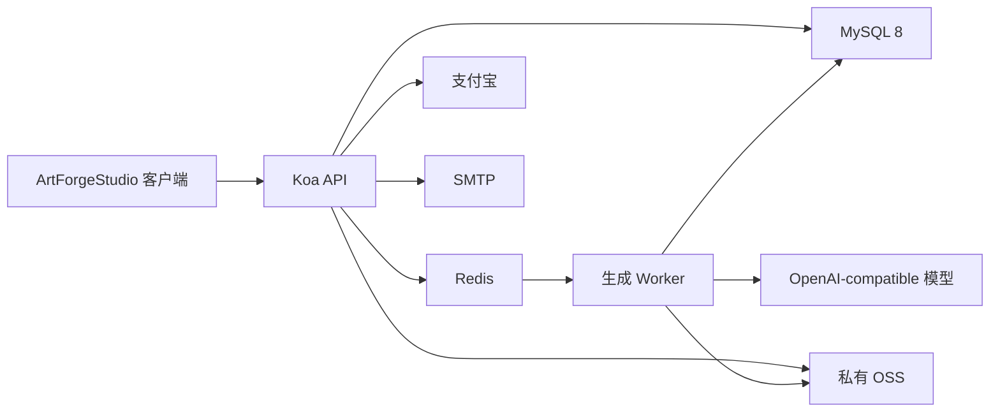

# ArtForge Studio 会员系统接入方案

> 状态：服务端主链路已实现，桌面客户端尚未接入
> 记录日期：2026-07-14
> 适用范围：ArtForgeStudio 桌面客户端、artforge-api 后端服务

数据库结构详见：[会员系统数据库设计](./MEMBERSHIP_DATABASE_DESIGN.md)。

## 1. 目标

为 ArtForgeStudio 接入服务端权威的账号、会员、积分、支付和模型生成体系。

核心原则：

- 用户、会员、订单、积分余额和积分流水以后端为唯一权威。
- 客户端只缓存展示数据，不能自行开通会员、增加积分或决定扣费结果。
- 会员计费的模型请求全部经过后端，平台模型密钥不下发到客户端。
- 图片最终永久保存在客户端，云端只承担异步任务所需的临时中转。
- 首版先完成后端闭环，再接入桌面客户端。

## 2. 仓库与目录

前后端使用两个完全独立的 Git 仓库，不嵌套，不使用 Git submodule。

```text
ArtForgeStudio/
├── ArtForgeStudio/              # 前端仓库，当前 Rust + Slint 客户端
└── server/
    └── artforge-api/            # 后端独立仓库
```

- 前端仓库：`ArtForgeStudio/ArtForgeStudio`
- 后端目录：`ArtForgeStudio/server/artforge-api`
- 后端远程：`https://cnb.cool/honeykid/ai/artforge-api`
- 后端 npm 包名：`artforge-api`

## 3. 会员等级

首版包含四个会员等级，所有付费套餐均为手动购买 30 天，不自动续费，不支持年付。

| 等级 | 价格/30天 | 赠送积分 | 充值折扣 | 最高清晰度 |
|---|---:|---:|---:|---|
| 免费会员 | ¥0 | 首次注册一次性 100 | 无 | 1K |
| 基础会员 | ¥19 | 每周期 2,000 | 95 折 | 2K |
| 高级会员 | ¥39 | 每周期 4,200 | 9 折 | 4K |
| 专业会员 | ¥59 | 每周期 6,500 | 85 折 | 4K |

以上价格和积分是试运营参数。正式上线前尚无真实模型成本数据，因此套餐、折扣、模型积分价格必须由后端配置并支持版本化调整。

### 3.1 免费会员

- 邮箱首次注册并通过风控后，一次性赠送 100 积分。
- 不提供每日签到积分。
- 不提供每月免费积分。
- 可以按原价充值积分。
- 即使有足够充值积分，也只能使用 1K 生图。

### 3.2 会员周期

- 每次购买生成一个独立的 30 天会员周期。
- 用户可以在任意时间、任意次数提前续费。
- 会员有效期累计没有上限。
- 已购买但尚未开始的周期进入待生效队列。
- 每个周期锁定购买时的套餐版本、赠送积分和清晰度权限。
- 后续调整套餐价格或权益，不影响已付款周期。
- 未来周期的赠送积分在对应周期开始时发放，不在付款时提前发放。
- `starts_at` 和 `ends_at` 是会员是否生效的权威依据，`scheduled/active/expired` 只是可重建的派生状态。
- Worker 定时激活周期并发放积分；`/account`、任务提交和支付处理也必须执行幂等追赶，避免定时任务停机导致权益延迟。
- 周期积分通过“用户 + 来源类型 + 周期 ID”唯一业务键发放，任何恢复或重试都不能重复赠送。

### 3.3 升级与降级

- 支持基础到高级、基础到专业、高级到专业的升级。
- 不支持降级。
- 当前周期升级时，按剩余时间比例计算价格差和积分差。
- 原会员到期时间不变。
- 升级支付成功后立即获得新清晰度权限。
- 如果存在尚未开始的预付周期，升级时必须同时升级全部未来周期。
- 未来周期按完整周期补差，并锁定升级后的套餐版本。
- 升级报价和结算全部由后端计算，客户端只展示结果。
- 创建会员购买、续费或升级订单时，后端为该用户创建 5 分钟会员变更占位；同一用户同时只允许一个未结束的会员变更订单。
- 订单创建后以不可变会员操作快照为准。周期激活等派生状态更新不能让已经付款的订单失去兑现条件。
- 支付成功后即使暂时无法写入权益，也必须进入可重试的“已支付待兑现”状态，不能直接失败或丢弃。

当前周期升级示例：

```text
基础会员剩余 15 天升级高级会员
补款 = (39 - 19) × 15 / 30 = 10 元
补发积分 = (4200 - 2000) × 15 / 30 = 1100 积分
```

升级差额只使用整数计算，禁止使用浮点数：

- 当前周期金额：`max(目标套餐价格分 - 原套餐价格分快照, 0) × 剩余秒数 ÷ 周期总秒数`，按分四舍五入，恰好半分时向上取整。
- 当前周期积分：`max(目标套餐积分 - 原套餐积分快照, 0) × 剩余秒数 ÷ 周期总秒数`，向下取整。
- 未来完整周期按完整价格差和积分差计算，不做比例折算。
- 正数金额折算后不足 1 分时按 1 分收取；整笔升级应付金额为 0 时不创建支付宝交易，由后端直接执行幂等升级。
- 历史低等级套餐价格高于当前目标套餐时不产生现金或积分倒退，不扣回已经获得的权益。
- 报价快照必须保存分子、分母、舍入前结果、舍入方式和最终结果，客户端只展示服务端结果。

## 4. 积分体系

### 4.1 充值基准

首版继续使用 `¥1 = 100 积分` 的基准，并保留四个充值档位：

| 原价 | 积分 |
|---:|---:|
| ¥10 | 1,000 |
| ¥50 | 5,000 |
| ¥100 | 10,000 |
| ¥300 | 30,000 |

会员折扣由后端按当前有效会员等级计算，客户端不能提交自定义金额、积分或折扣。

### 4.2 模型积分价格

当前试运营价格：

| 能力 | 积分成本 |
|---|---:|
| 1K 图片生成 | 20/张 |
| 2K 图片生成 | 30/张 |
| 4K 图片生成 | 60/张 |
| 提示词优化或翻译 | 2/次 |

模型目录和具体价格以后端配置为准。不同模型允许配置不同的清晰度支持范围和积分价格。

### 4.3 积分账户与有效期

积分按来源拆分为独立批次，不只维护一个可修改余额字段。

- 注册赠送积分：发放后 30 天有效。
- 会员周期赠送积分：随对应 30 天会员周期到期。
- 用户充值积分：永久有效。
- 扣减时优先使用最早到期的积分批次。
- 同一到期时间下，优先使用赠送积分，再使用充值积分。
- 余额是积分批次与账本汇总结果，不能由客户端覆盖。

### 4.4 扣减、结算与冲正

- 创建任务时由后端预占所需积分。
- 成功图片按实际成功数量结算。
- 失败图片对应积分自动释放。
- 支付订单不支持现金退款。
- 生成失败后的积分退回属于账本冲正，不属于现金退款。
- 所有预占、结算和冲正必须使用幂等业务号。
- 同一任务、订单或上游回调不能重复增加或扣减积分。

取消规则：

- 排队中取消：全部积分释放。
- 尚未调用模型时取消：全部积分释放。
- 已调用且上游确认取消：退回未消耗积分。
- 上游不支持取消：等待调用结束，成功部分扣费并交付，失败部分退回。

## 5. 账号与认证

### 5.1 登录方式

- 使用邮箱 + 一次性验证码登录。
- 不使用密码。
- 已存在邮箱验证成功后直接登录。
- 未注册邮箱验证成功后自动创建账号并登录。
- 邮箱统一规范化后建立唯一索引。
- 首版不提供账号注销功能。

### 5.2 邮箱验证码

- 6 位数字验证码。
- 5 分钟有效。
- 60 秒后允许重新发送。
- 单个验证码最多尝试 5 次。
- 同一邮箱每小时最多发送 5 次。
- 同一 IP 每小时最多发送 20 次。
- 验证成功或重新发送后，旧验证码立即失效。
- 验证码存入 Redis，不写入 MySQL。
- 开发环境允许在受控日志中输出验证码。
- 生产环境禁止在响应或普通日志中输出明文验证码。
- 邮件通过 SMTP 发送，凭据只存放在后端环境配置中。

### 5.3 注册赠送风控

- 每个已验证邮箱只赠送一次。
- 拦截已知临时邮箱域名。
- 同一设备最多为 2 个账号发放注册积分。
- 同一 IP 每天最多为 3 个账号发放注册积分。
- 超限后仍允许注册和登录，但不赠送积分。
- 后端记录赠送资格、判断结果和原因。
- 设备终身额度和 IP 每日额度由 MySQL 配额桶在注册事务内加锁、判断并占用，Redis 只能用于快速预筛选。
- 并发注册必须按固定顺序锁定设备和 IP 配额桶；事务回滚时不消耗额度，事务提交后不得再异步补计数。

### 5.4 Token 与会话

- `access_token` 使用 JWT，30 分钟有效。
- 桌面客户端通过 `X-Token` 请求头发送 access token。
- `refresh_token` 使用随机不透明令牌，30 天有效。
- 每次刷新都轮换 refresh token，旧 token 立即失效。
- 服务端保存 refresh token 哈希历史和父子轮换关系，不能只覆盖当前哈希。
- 已轮换的旧 token 再次出现时视为重放，服务端撤销整个 token family，并要求该设备重新登录。
- 每台设备对应一条服务端会话记录。
- 同一账号允许无限设备登录。
- 退出登录默认只撤销当前设备。
- 提供撤销全部设备会话的后端能力。
- 客户端将 refresh token 存入系统钥匙串，不写入本地 JSON。

### 5.5 登录与离线模式

- 未登录时显示不可关闭的登录弹窗，背后的工作台不可操作。
- 首次使用必须联网登录。
- 已经成功登录过的设备断网时，可以凭本地缓存进入离线模式。
- 离线模式允许浏览本地作品、编辑和保存提示词草稿。
- 离线模式禁止生成、支付、充值、升级和修改会员。
- 网络恢复后自动刷新 token、会员、积分和任务状态。
- 服务端会话已撤销时，客户端回到不可关闭的登录弹窗。

## 6. 协议与客户端版本

### 6.1 协议同意

首次登录前需要同意：

- 《用户协议》
- 《隐私政策》

首次购买会员或充值前需要同意：

- 《会员服务协议》
- 《积分规则》

后端记录用户、协议类型、协议版本、时间、IP 和设备 ID。协议发生重大变化时，可以要求重新确认。

### 6.2 最低客户端版本

- 每次 API 请求携带客户端版本和设备 ID。
- 后端配置最低支持版本。
- 低于最低版本时禁止登录、生成和支付等在线操作。
- 旧版本仍可进入本地离线模式，确保用户能够访问本地作品。
- 新会员版本上线后，旧客户端不能继续使用本地积分逻辑。

## 7. 支付与订单

### 7.1 支付渠道

- 首版只支持支付宝。
- 支付流程全部在桌面客户端内完成，不打开浏览器。
- 后端使用支付宝电脑网站支付创建签名收银台 URL。
- 客户端在应用内嵌 WebView 中打开收银台，不跳转系统浏览器。
- 支付成功只认支付宝异步通知和后端订单状态。

### 7.2 收银台生命周期

- 支付收银台 5 分钟有效。
- 客户端每 2 秒查询一次订单状态。
- 收银台过期后允许重新创建订单。
- 创建新订单前，后端先请求支付宝关闭旧交易；本地订单先进入 `closing`，收到关单成功或确认交易不存在后才能进入 `closed`。
- 旧交易未确认关闭前，不为同一业务创建新收银台，避免同一笔购买同时存在两个可支付交易。
- 用户关闭支付弹窗不等于支付失败。
- 再次进入时可以恢复未过期的待支付订单。
- 支付宝真实成功通知即使晚于收银台过期或本地关单也不能丢弃；订单标记为 `paid_late`，进入自动补偿或人工复核。
- 迟到支付优先按原订单快照兑现；若会员结构已经冲突，则保留为“已支付待兑现”，通过受审计运维命令处理，不支持直接修改数据库。

### 7.3 订单规则

- 会员购买、会员升级和积分充值使用不同的订单业务类型。
- 金额、积分、折扣、套餐版本和升级报价写入订单快照。
- 支付宝交易号建立唯一索引。
- 支付回调必须验签、校验商户、金额、订单状态和应用 ID。
- 同一支付回调可重复接收，但业务权益只能发放一次。
- 支付事实状态和权益兑现状态分别记录。已确认收款但权益尚未完成时，客户端展示“支付成功，权益处理中”。
- 回调记录只有达到 `processed` 才能对重复通知直接返回完成；`received` 和 `failed` 必须继续重试处理。
- 支付和权益处理失败由 Worker 扫描恢复，超过重试阈值后进入人工复核，不能把真实支付改回未支付或失败。
- 首版不提供现金退款入口。

## 8. 模型目录与生成任务

### 8.1 模型管理

- 首版只支持 OpenAI-compatible 协议。
- 后端分别配置图片生成模型和提示词处理模型。
- 模型目录、上线状态、支持清晰度和积分价格由后端下发。
- 普通客户端不再允许配置 Provider、Endpoint 或平台 API Key。
- 平台模型密钥只存在后端环境变量或密钥系统中。
- 首版不提供管理员 API 或管理网页。
- 套餐和模型目录通过 YAML 配置，并在启动时按版本同步到 MySQL。

### 8.2 并发与队列

- 同一账号跨所有设备最多并行 5 个生成任务。
- 超出并行限制的任务进入服务端队列。
- 每个账号首版最多保留 20 个排队任务，数值由后端配置；超过上限时拒绝新任务且不预占积分。
- API 进程只接收请求和查询状态，不直接执行长时间模型任务。
- Worker 从 Redis 队列取任务并调用模型。
- Worker 通过 Redis Lua 原子获取每用户最多 5 个带租约的运行槽位，运行期间持续心跳，终态时主动释放。
- Redis 槽位丢失或 Worker 崩溃后，以 MySQL 任务状态执行定期对账和回收；API 只负责入队，不直接增加运行计数。
- 任务状态首版通过 HTTP 轮询同步，不使用 WebSocket。
- 活动任务每 2 秒批量查询一次，无活动任务时停止轮询。

### 8.3 权益快照

- 提交任务时校验会员、清晰度和积分。
- 成功提交后记录不可变的权益与模型价格快照。
- 会员在任务运行中到期，不中断已经提交的任务。
- 会员到期后不能提交新的 2K 或 4K 任务。

## 9. 文件上传与本地交付

### 9.1 参考图

- 支持 JPEG、PNG、WebP。
- 单张最大 10 MB。
- 普通任务最多 8 张。
- 动作序列任务最多 1 张。
- 单任务参考图总量最大 40 MB。
- 后端校验真实文件类型并去除 EXIF。
- 参考图存入私有 OSS。
- 任务结束并完成交付后删除，异常情况下最长保留 24 小时。

### 9.2 生成结果

- 图片永久保存在客户端本地图库。
- Worker 生成完成后，将文件临时写入私有 OSS。
- 客户端获取短期签名 URL 并自动下载。
- 客户端校验文件后回传交付确认。
- 收到确认后，后端立即删除 OSS 对象。
- 未确认结果最多保留 24 小时，之后自动清理。
- 后端不提供永久云图库和公开图片 URL。

### 9.3 内容保留

- 参考图最长保留 24 小时。
- 生成图片最长保留 24 小时。
- 用户提示词和模型返回提示词保留 30 天。
- 30 天后只保留任务编号、模型、积分、耗时、状态和内容哈希。
- 用户主动删除任务时立即清理尚存内容。
- 订单和积分审计记录不随内容删除。

## 10. 会员提醒

- 到期前 7 天：客户端提醒一次。
- 到期前 3 天：客户端提醒并发送邮件。
- 到期前 1 天：客户端再次提醒。
- 到期后：通知会员已变为免费会员。
- 已提前续费并存在后续周期时，不发送无效到期提醒。

## 11. 后端架构

后端使用 Honeykid 风格单入口 Node.js Koa 服务：

- CommonJS
- Koa + koa-router + koa-components
- Joi 请求校验
- Sequelize + MySQL 8
- Redis
- JWT + `X-Token`
- SMTP
- 支付宝
- 阿里云 OSS
- OpenAI-compatible 模型适配器

运行进程：

```text
bin/www       HTTP API 进程
bin/worker    Redis 队列 Worker
bin/ops       受审计的单次运维命令入口，不作为常驻进程
```

系统关系：



### 11.1 目录职责

建议目录：

```text
artforge-api/
├── bin/
│   ├── www
│   ├── worker
│   └── ops
├── configs/
├── migrations/
├── src/
│   ├── app.js
│   ├── libs/
│   ├── logics/
│   ├── middlewares/
│   ├── models/
│   ├── routers/
│   │   └── v1/
│   ├── services/
│   └── utils/
└── package.json
```

- `routers`：路由、Joi filter 和薄 controller。
- `logics`：账号、会员、积分、订单和任务事务。
- `models`：Sequelize 模型定义。
- `services`：SMTP、支付宝、OSS、OpenAI 外部适配器。
- `libs`：MySQL、Redis、队列和基础设施客户端。
- `migrations`：每个数据库结构变更对应独立迁移。

首版虽然不提供管理 API 和管理网页，但必须提供最小化 `bin/ops` 命令，用于处理 `paid_late`、`manual_review` 和积分纠错。运维命令只能调用正式 logic，必须要求操作人、工单号、原因码和幂等键，并写入不可变审计记录；禁止直接执行手写 SQL 修改订单、会员周期或积分余额。

### 11.2 环境

首版只保留两个环境：

- 本地测试环境：本机 MySQL、Redis，允许模拟支付和模型适配器。
- 线上环境：生产 MySQL、Redis、SMTP、支付宝、OSS 和模型密钥。

首版不使用 Docker Compose，不设置独立 staging 环境。

所有配置文件只提交占位值。数据库密码、Redis 密码、JWT 密钥、SMTP 凭据、支付宝私钥、OSS 密钥和模型密钥不得提交到 Git。

## 12. 建议数据模型

以下表是实现基线，字段可在迁移设计阶段细化：

| 表 | 责任 |
|---|---|
| `users` | 邮箱账号、状态和基础资料 |
| `user_sessions` | 设备会话、token family 和撤销状态 |
| `session_refresh_tokens` | refresh token 哈希历史、轮换关系和重放检测 |
| `agreement_acceptances` | 用户同意的协议及版本 |
| `registration_grant_quota_buckets` | 设备终身和 IP 每日注册赠送配额 |
| `membership_plan_versions` | 版本化套餐价格和权益 |
| `membership_periods` | 当前及未来待生效的 30 天会员周期 |
| `membership_operations` | 支付期间冻结的会员变更意图与权益兑现状态 |
| `orders` | 会员购买、升级和积分充值订单 |
| `payment_transactions` | 支付宝交易事实、关单和迟到支付状态 |
| `payment_notifications` | 支付宝原始回调摘要与幂等状态 |
| `credit_accounts` | 用户积分汇总缓存 |
| `credit_lots` | 按来源和有效期拆分的积分批次 |
| `credit_ledger` | 预占、结算、冲正、过期和充值流水 |
| `model_versions` | 版本化模型目录、能力和积分价格 |
| `generation_tasks` | 生成任务、权益快照、状态和统计 |
| `generation_task_items` | 多图任务中每张图片的执行与结算结果 |
| `task_files` | 临时参考图和交付文件对象键、过期时间 |
| `registration_grants` | 注册积分发放资格和风控结果 |
| `operation_audits` | 运维修正的操作人、工单、原因和结果 |

积分账本、订单支付和会员周期变更必须放在 MySQL 事务中执行。Redis 只用于验证码、限流、队列、短期锁和缓存，不作为订单或积分权威数据源。

## 13. 建议 API 边界

### 13.1 认证

```text
POST /v1/auth/email/code
POST /v1/auth/email/login
POST /v1/auth/refresh
POST /v1/auth/logout
POST /v1/auth/logout_all
GET  /v1/account
```

### 13.2 会员与积分

```text
GET  /v1/membership/plans
GET  /v1/membership/current
POST /v1/membership/orders
POST /v1/membership/upgrade_quotes
POST /v1/membership/upgrade_orders
POST /v1/credits/orders
GET  /v1/credits/account
GET  /v1/credits/ledger
```

### 13.3 订单与支付

```text
GET  /v1/orders/:id
POST /v1/payments/alipay/notify
```

支付宝通知接口不使用用户 JWT，但必须执行支付宝验签和业务校验。

### 13.4 模型与生成

```text
GET  /v1/models
POST /v1/generation/tasks
GET  /v1/generation/tasks
GET  /v1/generation/tasks/:id
POST /v1/generation/tasks/:id/cancel
POST /v1/generation/tasks/:id/deliveries/:file_id/ack
```

### 13.5 上传

```text
POST /v1/uploads/references
POST /v1/uploads/references/:file_id/complete
DELETE /v1/uploads/references/:file_id
```

上传准备接口返回私有 OSS 短期 PostObject Policy、表单字段和文件字段名；客户端使用 multipart/form-data 直传后调用完成接口。Policy 锁定对象 key、MIME 和声明字节数，服务端继续验证真实图片类型并移除 EXIF。

首版不提供管理员 API。

## 14. 客户端改造

### 14.1 登录

- 将当前手机号字段改为邮箱。
- 删除固定验证码 `123456`。
- 登录弹窗在未认证时不可关闭。
- 增加协议勾选和验证码倒计时。
- 已认证断网设备提供“离线进入”。
- access token 只放内存，refresh token 存系统钥匙串。

### 14.2 会员与积分页面

- 将现有“积分”页面升级为“会员与积分”。
- 顶部展示当前等级、有效期、升级和续费入口。
- 展示四档会员卡和权益差异。
- 保留积分余额、充值档位和积分流水。
- 个人资料弹窗展示会员徽标。
- 支付弹窗内嵌打开后端返回的支付宝网站收银台，并展示订单状态。

### 14.3 模型与生成

- 移除客户端 Provider 配置入口。
- 模型列表和积分价格从后端加载。
- 选择 2K/4K 时按会员权限禁用或引导升级。
- 生成请求改为创建后端任务。
- 使用 HTTP 轮询同步任务状态。
- 生成完成后自动下载到当前本地图库。
- 下载校验成功后向后端确认交付。

### 14.4 本地数据迁移

- 不迁移、不上传旧手机号、本地登录状态、积分余额和充值流水。
- 新版本要求邮箱重新登录。
- 服务端首次注册只发放 100 积分。
- 保留本地作品、提示词草稿、主题和界面设置。
- 旧 Provider/API Key 不上传、不继续使用，也不擅自删除原本地数据文件。

## 15. 实施顺序

### 阶段 1：后端基础闭环

- 创建独立 `artforge-api` 仓库。
- 生成 Honeykid Koa 单入口骨架。
- 接入 MySQL、Redis、migrations 和 Worker 入口。
- 完成账号、会话、协议、会员周期、积分账本、订单和任务模型。
- 完成 refresh token 历史、注册配额桶、会员操作占位、支付兑现恢复和运维审计模型。
- 使用测试 SMTP、支付、OSS 和模型适配器跑通事务闭环。

### 阶段 2：真实外部服务

- 接入真实 SMTP。
- 接入支付宝电脑网站支付、验签、异步通知和订单轮询。
- 接入私有 OSS 临时上传与自动清理。
- 接入 OpenAI-compatible 图片和提示词模型。
- 验证幂等、超时、关单、迟到支付、崩溃恢复、取消和失败冲正。

### 阶段 3：客户端接入

- 接入邮箱验证码登录和 token 刷新。
- 接入会员与积分页面。
- 接入支付宝内嵌网站支付。
- 移除客户端 Provider 设置。
- 将生成流程切换为后端任务。
- 接入自动下载与交付确认。

### 阶段 4：回归与上线准备

- 登录、离线登录和会话失效回归。
- refresh token 轮换、旧 token 重放和 token family 撤销回归。
- 注册赠送风控与并发配额回归。
- 会员购买、续费、升级和未来周期转换回归。
- 周期激活停机追赶、重复激活和积分幂等发放回归。
- 积分预占、成功结算、部分失败和取消冲正回归。
- 支付回调重复、处理中崩溃、金额不符、关单和迟到支付回归。
- 1K/2K/4K 权限回归。
- 多设备、每账号 5 个运行槽位和 20 个排队上限回归。
- 使用超过 `2^53 - 1` 的 ID、积分和金额值验证 BIGINT 序列化规则。
- 本地图片自动下载和 OSS 清理回归。
- 原有工作台和本地图库界面回归。

## 16. 首版明确不做

- 自动续费。
- 年付套餐。
- 会员降级。
- 现金退款。
- 账号注销。
- 管理员 API。
- 管理网页。
- WebSocket/SSE。
- 多种专有模型协议。
- 永久云图库。
- Docker Compose。
- 独立 staging 环境。

## 17. 已接受风险

### 17.1 无真实模型成本数据

当前套餐和积分价格是试运营参数。上线前必须采集真实模型成本，并监控每个模型、清晰度和会员等级的毛利率。建议目标毛利率不低于 60%。

### 17.2 无限设备

账号允许无限设备登录，存在账号共享风险。首版使用每账号最多 5 个并行任务、注册赠送风控和服务端积分权威降低风险，后续仍需根据数据评估设备限制。

### 17.3 无限提前续费

会员有效期累计没有上限，且已购周期锁定成交权益。用户可以在调价前囤积旧价格周期，这是明确接受的商业风险。

### 17.4 暂无账号注销

首版不提供账号注销会形成隐私与合规债务。数据模型必须避免把业务记录与可识别个人信息不可逆绑定，为后续匿名化注销留出空间。

### 17.5 无管理端

套餐和模型依赖 YAML 配置及启动同步。每次配置修改必须经过校验、版本提升、数据库备份和发布审核，避免错误配置直接影响线上计费。异常订单和积分纠错只通过受审计 `bin/ops` 命令完成；没有管理页面不等于允许直接改库。

### 17.6 只有本地测试和生产环境

没有独立 staging 会增加真实外部服务联调风险。生产配置必须支持小额测试账号、测试模型和受控灰度，且测试数据不能混入正常用户账本。

## 18. 后续开始条件

开始阶段 1 前需要准备但不提交到 Git 的配置：

- 本地 MySQL 连接信息。
- 本地 Redis 连接信息。
- JWT 和 refresh token 加密/哈希密钥。
- SMTP 主机、端口、用户名、密码和发件地址。
- 支付宝 app_id、应用私钥、支付宝公钥和通知地址。
- OSS bucket、region、access key、secret 和私有访问域名。
- OpenAI-compatible endpoint、API Key、图片模型和提示词模型 ID。
- 生产 API 域名与最低客户端版本。

所有敏感值只写入本地或生产环境配置，不写入本文档、示例配置或 Git 历史。

## 19. 尚未确认的细节

以下内容不阻塞后端骨架，但在对应功能实现前仍需确认：

- 登录邮箱是否允许修改，以及旧邮箱、新邮箱的双重验证流程。
- 线上 SMTP 服务商的连接方式和发件模板。
- 支付宝电脑网站支付生产产品开通状态及真实小额支付验收。
- OpenAI-compatible 图片模型和提示词模型在生产中转服务上的真实调用验收。
- 各模型的真实人民币调用成本和正式积分价格。
- 生产 API 域名、OSS 访问域名和最低客户端版本初始值。
